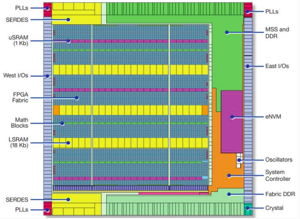
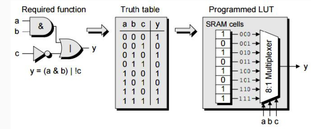
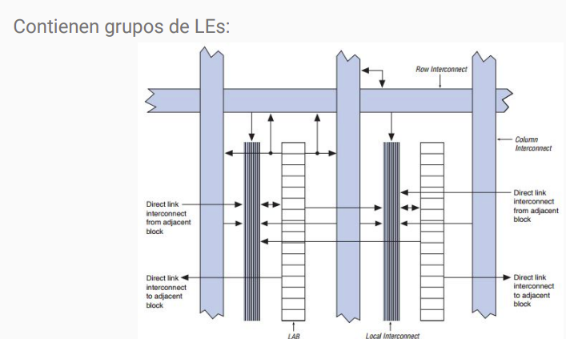
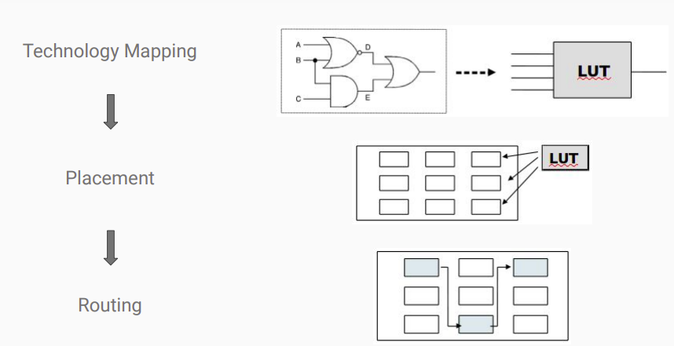

 

<strong>🔧 Práctico de AdC 🔧
</strong>

---

 

## Field Programmable Gate Arrays(FPGAs)

Nos permite implementar circuitos digitales y nos permite reconfigurarlo. Es en dónde vamos a implementar el micro.

FPGAs: Arreglos de compuertas programables en campo.

Son circuitos integrados digitales que contienen bloques lógicos programables junto con un interconexiones entre dichos bloques. Es parecido a una PLA pero con la diferencia de que los bloques lógicos son programables.

- **ASIC**: Circuito integrado de aplicación específica. Son "hechos a medida". Son más rápidos que las FPGA, consumen menos energía y son fabricados en gran escala, son más baratos.

- **FPGA**: Circuito integrado programable. No son hechas a medida, por lo que el usuario puede configurarlas de acuerdo a sus necesidades.

### FPGA: Elementos básicos
Una FPGA tiene adentro:
- Elementos lógicos
- Recursos de memoria
- I/O configurables: puertos.
- Recursos de ruteo: posibilidad de conexionado (el secreto de las FPGA).
- Recursos adicionales

### FPGA: Elementos lógicos(LUT)
La función lógica se almacena en una tabla de verdad 16x1 (para las LUTs de 4 entradas). La columna de valores de salida de la función combinacional son los valores que realmente se almacenan en la LUT.

<em>El resultado se llama bitstream</em>

### FPGA: Utilización del Roteo

### Flujo de diseño

- Design Entry: Se puede hacer en HDL o en un lenguaje de descripción de hardware.

- Synthesis: Se traduce el código HDL a un netlist. Tarda mucho más que una compilación de un código. Conbierte en un combinacional.

- Place & Route: Se ubican los elementos lógicos y se hace el ruteo. Se puede hacer de manera automática o manual.

- Timing Analysis: Se verifica que el circuito cumpla con los tiempos de propagación.

- Simulation: Se simula el circuito.

- Programming & Configuration: Se programa la FPGA.

<em>Compilación del circuito</em>

