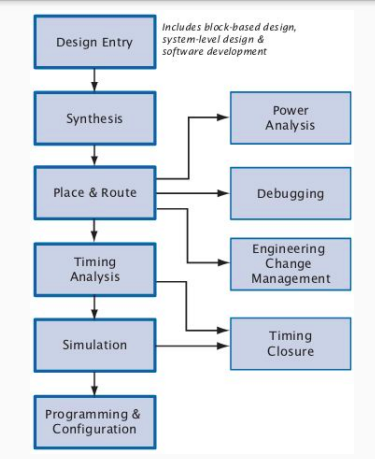

<br>
<p align="center" style="font-size:30px"><strong>🔧 Práctico de AdC 🔧 
</strong></p>

---

<br>

# Versión importante
==EP4CE22F17C6==
---

# Field Programmable Gate Arrays(FPGAs)

Nos permite implementar circuitos digitales y nos permite reconfigurarlo. Es en dónde vamos a implementar el micro.

FPGAs: Arreglos de compuertas programables en campo.

Son circuitos integrados digitales que contienen bloques lógicos programables junto con un interconexiones entre dichos bloques. Es parecido a una PLA pero con la diferencia de que los bloques lógicos son programables.

- **ASIC**: Circuito integrado de aplicación específica. Son "hechos a medida". Son más rápidos que las FPGA, consumen menos energía y son fabricados en gran escala, son más baratos.

- **FPGA**: Circuito integrado programable. No son hechas a medida, por lo que el usuario puede configurarlas de acuerdo a sus necesidades.

### FPGA: Elementos básicos
Una FPGA tiene adentro:
- Elementos lógicos
- Recursos de memoria
- I/O configurables: puertos.
- Recursos de ruteo: posibilidad de conexionado (el secreto de las FPGA).
- Recursos adicionales


### FPGA: Elementos lógicos(LUT)
La función lógica se almacena en una tabla de verdad 16x1 (para las LUTs de 4 entradas). La columna de valores de salida de la función combinacional son los valores que realmente se almacenan en la LUT.


<p style="text-align: center;"><em>El resultado se llama bitstream</em></p>

### FPGA: Utilización del Roteo


### Flujo de diseño


- Design Entry: Se puede hacer en HDL o en un lenguaje de descripción de hardware.

- Synthesis: Se traduce el código HDL a un netlist. Tarda mucho más que una compilación de un código. Conbierte en un combinacional.

- Place & Route: Se ubican los elementos lógicos y se hace el ruteo. Se puede hacer de manera automática o manual.

- Timing Analysis: Se verifica que el circuito cumpla con los tiempos de propagación.

- Simulation: Se simula el circuito.

- Programming & Configuration: Se programa la FPGA.


<p style="text-align: center;"><em>Compilación del circuito</em></p>


## Behavioral SystemVerilog
> Siempre un módulo por archivo y tener el nombre del módulo = al nombre del archivo.

#  Introducción a System Verilog
## Módulos parametrizados
* Los parámetros se definen de la siguiente forma:
```verilog
#(parameter variable = valor)
```
* Uso por defecto con un bus de 8 bits sin parametrización:
```verilog
mux2 myMux(d0,d1,s,out);
```

* Uso con un bus de 12 bits con parametrización:
```verilog
mux2 #(12) lowmux(d0,d1,s,out);
```

## Arreglos
Difieren en la forma de acceder a los elementos del arreglo.

Los arreglos empaquetados primero tengo que acceder al sector del paquete y luego al elemento del paquete.

Los arreglos no empaquetados se accede directamente al elemento.

Para definir un arreglo empaquetado debo escribir en la sintaxis el nombre al final.

* A la hora de cargar un arreglo no empaquetado se puede decidir el orden de la carga de datos:

    `logic [7:0] table[0:3]`

  Podemos modificar el orden en `table`

* A la hora de acceder a un arreglo debemos tener en cuenta la declaración, ya que su sintaxis es: 
* `logic` [cantidad de bits:fin cantidad de bits] nombre [fin de elementos: inicio]
Por ende para acceder al bit 0 del elemento 1 utilizamos: `nombre[0][1]`

## Test bench
Tipos:
 * Simples.
 * Self-checking.
 * Self-checking with test vectors: Tener entradas predefinidas en un arreglo para testear.

Tener en cuenta las palabras reservadas como always, always_ff, initial, etc. Funcionan de forma concurrente. 

En los test simples definimos todo de forma manual.

Cuando definamos una unidad de tiempo, esta no puede ser menor a 1 valor de alguna Unidad de medida determinada en el simulador SIEMPRE y cuando no lo nombremos ya que podemos tener el siguiente caso.

```verilog
#10ns; //Al simulador no le va a importar la unidad de tiempo por default
#1000; //Considera la unidad de tiempo del simulador.
```
* El símbolo "!==" es distinto.
* El símbolo "===" es estrictamente igual.

```verilog
logic [3:0] testvectors [7:0] = '{
    4'b000_0, 4'b000_1, 4'b001_0, 4'b001_1,
    4'b010_0, 4'b010_1, 4'b011_0, 4'b011_1
};
//Al _ lo utilizo para señalar cual es la salida esperada.
```

# Repaso a Leg v8
Recordar que se utilizarán registros de 64 bits.