# Teórico
Aprenderemos en detalle el funcionamiento interno y el incremento de performance de computadoras y un uso intenso de lógica programable (FPGas, HDLS)..

# Indice
- [Tema 1: Hardware Description Languages (HDLs): VHDL y System Verilog (Un estudio comparativo)](#tema-1-hardware-description-languages-hdls-vhdl-y-system-verilog-un-estudio-comparativo)

- [Tema 2: Modelado Estructural y Comportamental](#tema-2-modelado-estructural-y-comportamental)

- [Repaso ISA](#repaso-isa)


# Tema 1: Hardware Description Languages (HDLs): VHDL y System Verilog (Un estudio comparativo)

<p align="center">Lenguajes utilizados para escribir Hardware (Según Pablo)
</p>

**VHDL**:  es un acrónimo para VHSIC Lenguaje de descripción de Hardware. VHSIC es un acrónimo para los proyectos de circuitos integrados de muy alta velocidad. Básicamente utilizado como un estándar. Muy utilizado para simulación y sintetización. VHDL es un lenguaje de modelado, no de especificación. _"Todo lo que existe puede ser modelado, pero no todo lo que se especifica puede ser sintetizado."_

**Verilog**: Fué desarrollado por Gateway Deign Automation como un lenguaje propieatario para la simulación lógica en 1984. En 1990 se convirtió en un estándar IEEE. Hay muchos textos en Verilog, pero el estándar IEEE es legible y autorizado. Lenguaje de descripción de Hardware utilizado para modelar sistemas electrónicos. A veces llamado Verilog HDL (Hardware Description Language).

```vhdl
-- VHDL
library IEEE; use IEEE.STD_LOGIC_1164.all

-- Interfaz
entity sillyfunction is
    port(a, b, c: in STD_LOGIC;
         y:       out STD_LOGIC);
end sillyfunction;

-- Implementación
architecture synth of sillyfunction is
begin
    y <= ((not a) and (not b) and (not c)) or
         ((not a) and (not b) and c) or
         ((not a) and b and (not c)) or
         ((not a) and b and c) or
         (a and (not b) and (not c)) or
         (a and (not b) and c) or
         (a and b and (not c)) or
         (a and b and c);
end;
```
**System Verilog:** Es una extensión de Verilog que incluye muchas características nuevas y mejoradas para la descripción de hardware y la verificación.

```verilog
//System Verilog
//Combinacional
module sillyfunction(input logic a, b, c, output logic y);
    assign y = ~a & ~b & ~c |
               ~a & ~b & c  |
               ~a & b & ~c
```

```vhdl
--VHDL  
--Tener en cuenta que en la salida y las entradas son vectores de 32 bits
library IEEE; use IEEE.STD_LOGIC_1164.all
use IEEE.STD_LOGIC_UNSIGNED.all

entity adder is
    port(a, b: in STD_LOGIC_VECTOR(31 downto 0);
         y: out STD_LOGIC_VECTOR(31 downto 0));
end;

architecture synth of adder is
begin
    y <= a + b;
end;
```

```verilog
//System Verilog
//Ahora tener en cuenta que las entradas y salidas son base de 32 bits
module adder(input logic [31:0] a, 
            input logic [31:0] b, 
            output logic [31:0] y);
    assign y = a + b;
end;
```

> Las operaciones de VHDL y System Verilog se realizan bit a bit. 

Entonces con todos estos ejemplos tenemos que si asignamos una arquitectura `synth` estaremos declarando un bloque de hardware que se va a sintetizar en un chip. (Grafiquito de compuertas; Sintetizador -> Chip)

## Operadores de Reducción
VDHL no tiene operadores de reducción, pero System Verilog si. En caso de VHDL lo podemos definir explícitamente.

```verilog
//System Verilog
module and8(input logic [7:0] a, output logic y);
    assign y = &a;

    //&a is much easier to write than
    // assign y = a[0] & a[1] & a[2] & a[3] & a[4] & a[5] & a[6] & a[7];    
endmodule
```
```VHDL
--VHDL
library IEEE; use IEEE.STD_LOGIC_1164.all

entity and8 is
    port (a: in STD_LOGIC_VECTOR(7 downto 0);
          y: out STD_LOGIC);
end;

architecture synth of and8 is
begin
    y <= a(0) and a(1) and a(2) and a(3) and a(4) and a(5) and a(6) and a(7);
end;
```
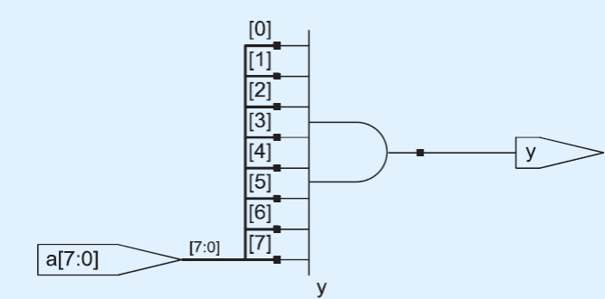

## Multiplexores
Literalmente (o no tanto) es como un if.
    
```verilog
//System Verilog
//Impementación de un multiplexor de 4 entradas con "2 mux".
module mux4(input logic [3:0] d0,d1,d2,d3,
               input logic [1:0] s,
               output logic y);

    asign y = s[1] ? (s[0] ? d3 : d2) 
                   : (s[0] ? d1 : d0);  
endmodule 
```
```VHDL
library IEEE; use IEEE.STD_LOGIC_1164.all
entity mux4 is
    port(d0, d1, d2, d3: in STD_LOGIC;
         s: in STD_LOGIC_VECTOR(1 downto 0);
         y: out STD_LOGIC);
end;

architecture synth of mux4 is
begin
    y<= d0 when s = "00" else
        d1 when s = "01" else
        d2 when s = "10" else
        d3;
end;
```

En este caso el if está implícito en la asignación de `y`.

## Señales
En VHDL las señales son utilizadas para representar variables internas cuyos valores son definidos con señales concurrentes. Por ejemplo y <= a xor b.

En System Verilog las señales internas normalmente se definen como `logic`.

## Números

En System Verilog la notación es particular:
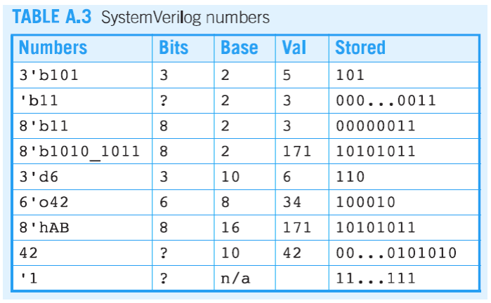
- Se debe tener muy en cuenta la notación, primero mencionamos la cantidad de bits con `x'` y si no está explícita "CREO" que se asume que es 32 bits.

-  `_` nos sirve para separar los bits y hacer más legible el código.

- Luego de definir la cantidad de bits con `'` luego definimos el tipo de número por ejemplo `b` para binario, `d` para decimal, `h` para hexadecimal, `o` para octal. Seguido de esto mencionamos el número dependiendo la familia que hayamos elegido.
    * Si no mencionamos nada se asume que es decimal.
- `'1` rellena con 1s a la izquierda en 32 bits.

## Zs y Xs
- `Z` significa que la señal está en alta impedancia.
- `X` significa que la señal es desconocida.

```VHDL
--VHDL
library IEEE; use IEEE.STD_LOGIC_1164.all
entity tristate is 
    port(a: in STD_LOGIC_VECTOR(3 downto 0);
         en: in STD_LOGIC;
         y: out STD_LOGIC_VECTOR(3 downto 0));
end;

architecture synth of tristate is
begin
    y <= "ZZZZ" when en = '0' else a;
end;
```

```verilog
//System Verilog
module tristate(input logic [3:0] a, 
                input logic en, 
                output logic [3:0] y);
    assign y = en ? a : 4'bz;
endmodule
```
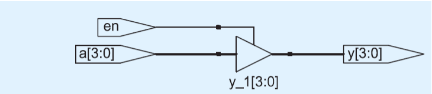

## Bit Swizziling
- La concatenación en VHDL se hace con `&` y en System Verilog con `{}`.

```VHDL
--VHDL
y <= a(3 downto 0) & d(0) & d(0) & d(0);
```

```verilog
//System Verilog
//La notación es la de la GreenCard de Orga
assign y = {a[3:0], {3{d[0]}}, 3'b101};
```

```verilog
//System Verilog
// El resultado es la concatencación de upper y lower.
module mul(input logic [7:0] a, b,
           output logic [7:0] upper, lower);
    assign {upper, lower} = a * b;
endmodule
```


```verilog
//System Verilog
module signextend(input logic [15:0] a,
                  output logic [31:0] y);
    assign y = {{16{a[15]}}}, a[15:0];
endmodule
```

```VHDL
--VHDL
-- Tengo que implementar
```

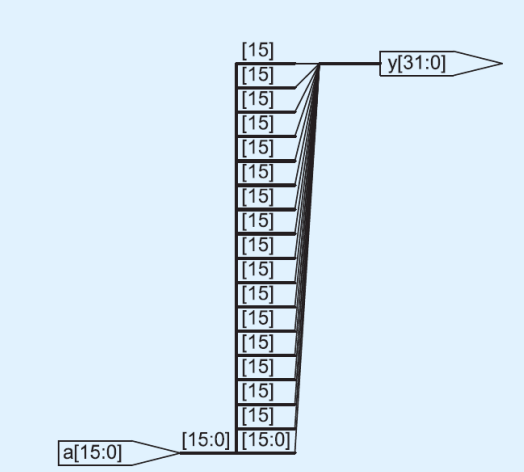

## Delays
- En VHDL los delays se pueden especificar en la simulación, pero no en la síntesis.
- En System Verilog los delays se pueden especificar en la simulación y en la síntesis.

```verilog
//System Verilog
`timescale 1ns/1ps
module example(input logic a,v,c,
               output logic y);
    logic ab,bb,cb,n1,n2,n3;

    assign #1 {ab,bb,cb} = ~{a,b,c};
    assign #2 n1 = ab & bb & cb;
    assign #2 n2 = a & bb & cb;
    assign #2 n3 = a & bb & c;
    assign #4 y = n1 | n2 | n3;
endmodule
```

# Tema 2: Modelado Estructural y Comportamental

El modelado estructural es una forma de modelar un sistema en el que se especifica la estructura del sistema y cómo se conectan los componentes. El modelado estructural se puede hacer en VHDL y System Verilog.

```verilog
//System Verilog
module mux4(input logic [3:0] d0,d1,d2,d3,
               input logic [1:0] s,
               output logic y);

    logic [3:0] low, high;

    //mux2 se queda guardado en una librería local para otros usos.
    mux2 lowmux(d0,d1,s[0],low);
    mux2 highmux(d2,d3,s[0],high);
    mux2 finalmux(low,high,s[1],y);
endmodule
```
#### Partes de accesos de buses
```verilog
//System Verilog
module mux2_8 (input logic [7:0] d0, d1,
               input logic s,
               output logic [7:0] y);

    mux2 lsbmux (d0[3:0], d1[3:0], s, y[3:0]);
    mux2 msbmux (d0[7:4], d1[7:4], s, y[7:4]);
endmodule
```

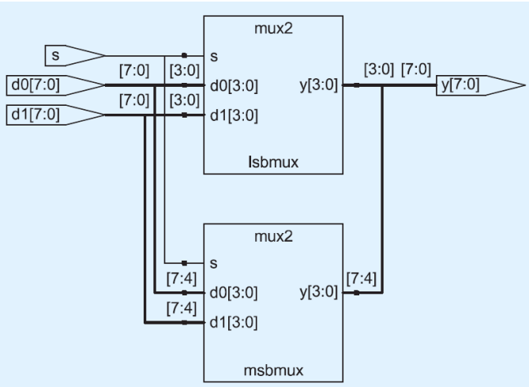

#### Lógica secuencial - Registros

- **always**:es una estructura particular que toma una lista de sensibilidad y un bloque de código. El bloque de código se ejecuta cada vez que uno de los elementos de la lista de sensibilidad cambia de valor. 

- **always_comb**: no se le indica la lista de sensibilidad, se asumen que están todas las de las entradas.
- **always_ff**: Como es un FF necesito definir correctamente la lista de sensibilidad. Siempre `clock` pero no siempre se utilizará `reset`. En este caso nos interesan las palabras reservadas `posedge` y `negedge`, dependerá de los flancos que quieramos tener en cuenta.


- Flip Flops:

    ```verilog
    //System Verilog
    //Flip-Flop
    module flop(input logic clk,
                input logic [3:0]d,
                output logic [3:0] q);

        //posedge: cuando haya un flanco de subida en clock.
        always_ff @(posedge clk)
            q <= d;
    endmodule
    ```

    > Diferencia entre `assign` y <=, si se pone assign se comporta como un combinacional, si se pone <= se comporta como un flip-flop en el sentido de que se actualiza en el flanco de subida.

    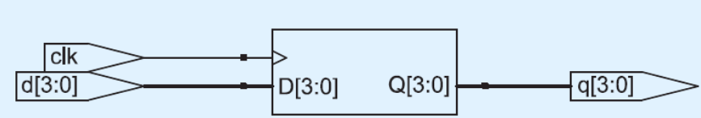

- Registros reseteables:
    ```verilog
    //Reseteo Síncrono
    module flopr(input logic clk,
                 input logic reset,
                 input logic [3:0] d,
                 output logic [3:0] q);

        always_ff @(posedge clk)
            if (reset)
                q <= 4'b0;
            else
                q <= d;
    endmodule

    //Reseteo Asíncrono
    module flopr(input logic clk,
                 input logic reset,
                 input logic [3:0] d,
                 output logic [3:0] q);
    
        always_ff @(posedge clk, posedge reset)
            if (reset)
                q <= 4'b0;
            else
                q <= d;
    endmodule
    ```
    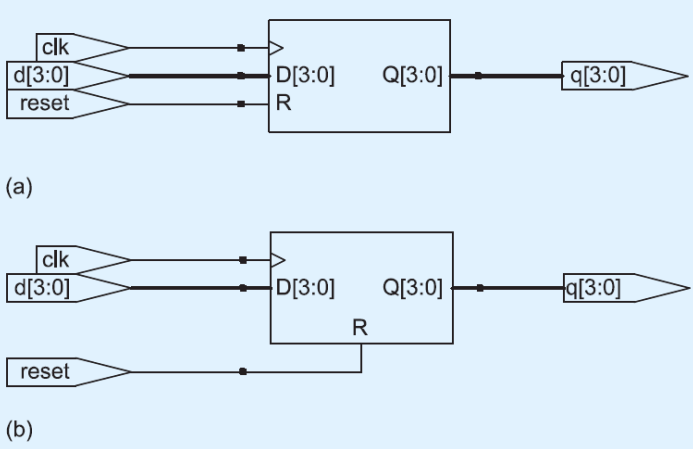


- Enabled Registers:
    ```verilog
    module flopenr(input logic clk,
                   input logic reset,
                   input logic en,
                   input logic [3:0] d,
                   output logic [3:0] q);
    
    //Reset síncrono
    always_ff @(posedge clk)
    if (reset) q <= 4'b0;
    else if (en) q <= d;
    endmodule
    ```

- Registros múltiples
    ```verilog
    module sync(input logic clk,
                input logic d,
                outpur logic q);

        logic n1;

        always_ff @(posedge clk)
            begin
                //El nuevo n1 es d
                n1 <= d;
                //El viejo n1 es q
                q <= n1;
            end
    endmodule
    ```

    > Si le dejas la flecha ocurre en paralelo(los `comentarios` del código lo representan) y si le ponés igual ocurre en serie, i.e secuencial.

#### Latch
Los latch son flip-flops transparentes, es decir, que la salida se actualiza en el flanco de subida y bajada. En cambio los flip-flops se actualizan en el flanco de subida.


```verilog
    module latch(input logic clk,
                 input logic[3:0]d,
                 input logic[3:0]q);
        always_latch
        if(clk) q<=d;
    endmodule

```
#### Multiplexores
```verilog
//System Verilog
//Parameterized N:2^N
//2**
module decoder # (parameter N=3)
                 (input logic [N-1:0] a,
                  output logic [2**N-1:0] y);

//Proceso que me permite 
always_comb
    begin
        y = 0;
        y[a] = 1;
    end
endmodule

```
### Módulos parametrizados N-bit

```verilog
module andN
       #(parameter width=4)
       (input logic [width-1:0] a;
        output logic            y);

//Variable de tipo especial
genvar i;
//Variables de tipo interna (Cables)
logic [width-1:1] x;

generate
    for (i=0; i<width; i=i+1) begin:forloop
        if (i == 1)
            assign x[i] = a[0] &  a[1];
        else
            assign x[i] = x[i-1] & a[i];
    end
endgenerate

assign y = x[width-1];
```

### Memoria RAM con separador Din y Dout

<p align ="center" >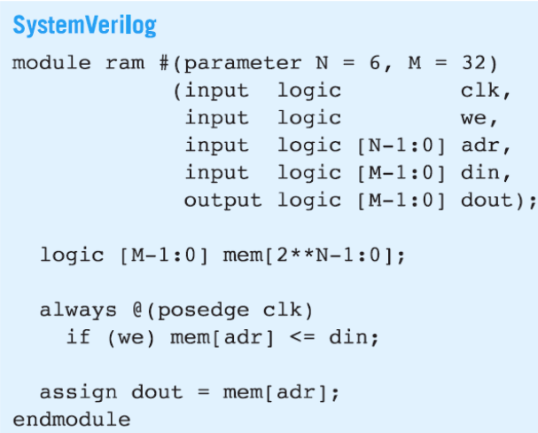</p>

- N: 6
- M: 32 bits
- mem: arreglo bidimencional de 2**6 x 32 bits
- clk: Reloj
- WE: Write Enable
- Din: bus de datos [31-0]
- Dout: bus de datos [31-0]

<p align="center" style="font-size:30px">Sintetización</p>

<p align ="center" >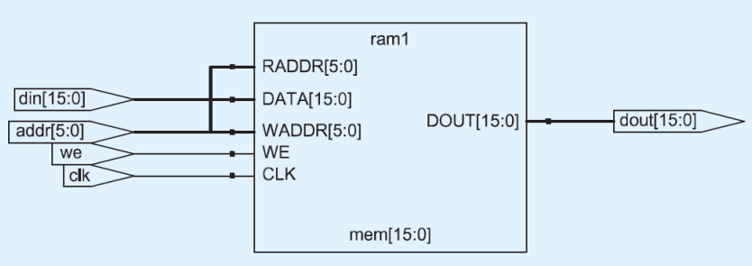</p>

<br>

En el siguiente ejemplo tener en cuenta cuando asignar el dato, en este caso cuando `WE` es 0. En el caso de `WE` es 1 se asigna 'z que es alta impedancia. 

<p align ="center" >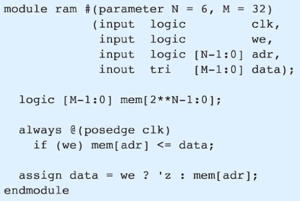</p>


-tri: alta impedancia (bus donde salen los datos y un bus donde entran los datos por separado)
- posedge: flanco de subida.

### Memoria ROM

Recordar que la memoria ROM es un combinacional, en este ejemplo se detalla una mamoria ROM pequeña.

<p align ="center" >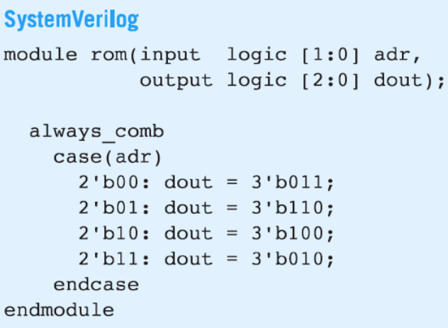</p>

### Test Benches

- . # Unidades de tiempo

Entorno (Wrapper) de pruebas que se utiliza para verificar y validar el funcionamiento de un diseño de hardware, como un circuito digital o un sistema basado en FPGA (Field-Programmable Gate Array). Los Test Benches son fundamentales en el proceso de diseño de hardware, ya que permiten simular y probar cómo se comporta un circuito bajo diversas condiciones antes de implementarlo físicamente.

#### Llamada Sofisticada
 - dut: Device Under Test
 - Las demoras con #, son esenciales para que le dé tiempo a los `asserts` para actuar.

<p align ="center" >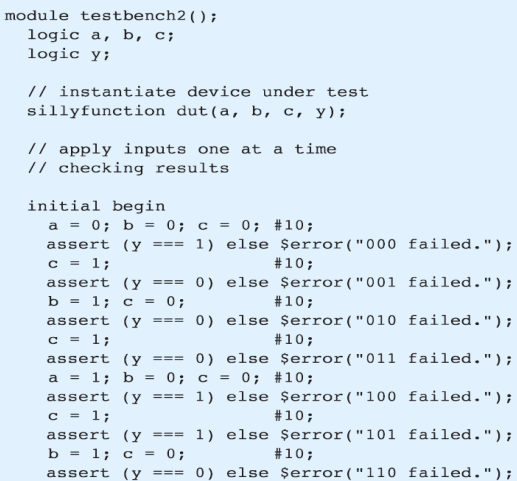</p>

#### En un archivo de vector (Simulación completa)

- 'bx: es indefinido
- $finish: terminar la simulación
<p align ="center" >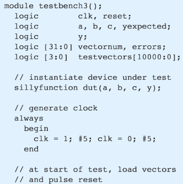</p>

<p align ="center" >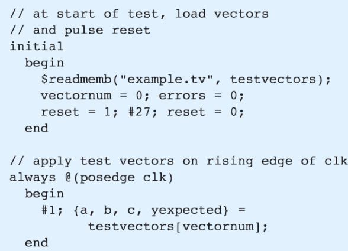</p>

<p align ="center" >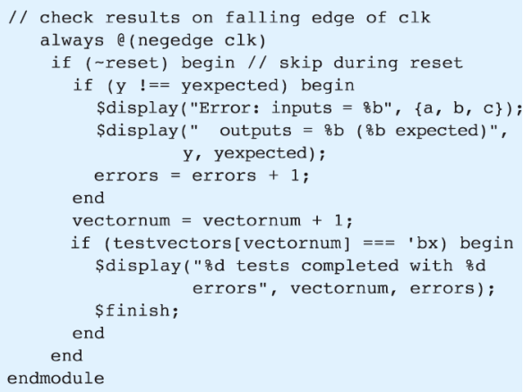</p>

# Repaso ISA

* [GreenCard](GreenCardLEGv8_OK.pdf)

Recordar el formato, normalmente:

* |INSTRUCCIÓN| **|Almacenamiento|**, **|V1|**, **|V2|**


Por ejemplo ADD a, b, c // se obtiene a = b + c

LEGv8 tiene archivos de registro de 32 x 64bits. i.e 5 entradas de address de palabras de 64 bits.
 - 32 registros de 64 bits de largo.

No pueden tener otras entradas de address porque sino el direccionado de las instrucciones debería ser más grande.

* Los datos de 64-bits son llamados "doubleword" X0 a X30.
* Los datos de 32-bits son llamados "word" de W0 a W30.

## **Registros**

- XZR: Registro con cero. No se puede escribir en él.

<p align ="center" >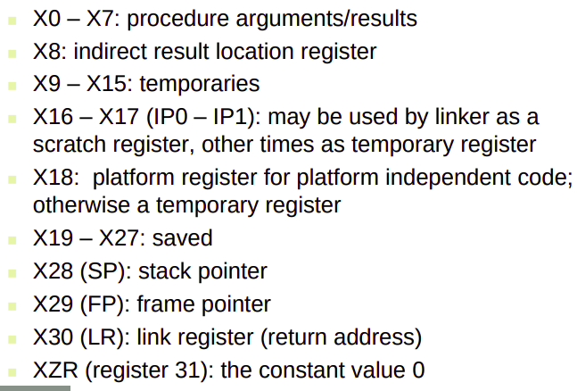</p>

## Operandos de memoria
* La memoria está direccionada por bytes.
    * Cada dirección de memoria son 8 bytes

* Little Endian: La dirección más baja es el byte menos significativo.
* Big Endian: La dirección más baja es el byte más significativo.

* La memoria rom es una memoria de micro código.

* Campos de instrucciones
* Rm: Segundo argumento de registro.
* Rn: Primer argumento de registro.
* Rd: Registro de destino.
* Rt: Registro de target

## Máscara
El concepto de máscara se utiliza para filtrar bits de un registro. Por ejemplo se lo puede hacer con la instrucción AND, tal que tengo al registro que quiero filtrar con una máscara de un registro que tiene unos en los lugares que quiero filtrar y ceros en los que no. Para lograr este efecto puedo utilizar otras compuertas.


