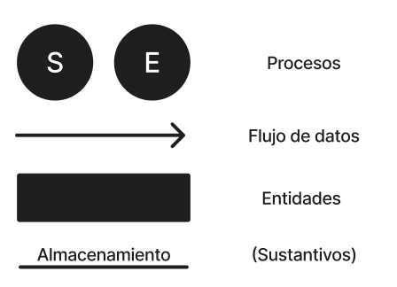
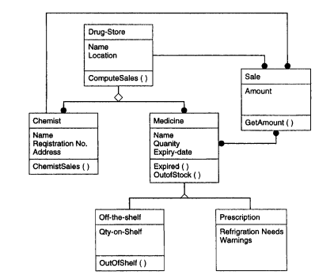

# Resumen del libro: **Texts in Computer Science: An Integrated Approach to Software Engineering**

En este archivo se encontrará un resumen para poder tener a mano los conceptos más importantes a mi parecer del libro de Pankaj Jalote.

---

Recomendación: Leer los capítulos antes de ir al teórico.

# Índice
- **[Chapter 1: Introduction](#chapter-1-introduction)**
    - [The Problem Domain](#the-problem-domain)
    - [The Software Engineering Challenges](#the-software-engineering-challenges)
    - [Summary](#summary)

- **[Chapter 3: Software Requirements Analysis and Specification](#chapter-3-software-requirements-análysis-and-specification)**

- **[Chapter 4: Arquitectura de Software](#chapter-4-arquitectura-de-software)**

# Chapter 1: Introduction

## The Problem Domain

Software (Según la IEEE): Colección de programas, procedimientos, y la documentación y datos asociados que determinan la operación de un sistema de computación.

A nivel **INDUSTRIA**:
- Los usuarios son otras personas.
- Aquí el **ERROR** no es tolerable.
- La interfaz con el usuario es muy importante (Porque vende más)
- Se requiere documentción tanto para el usuario como para la organización.

> La diferencia clave con el software pesnado por un alumno y el de nivel industrial radica en la calidad: usabilidad, confiabilidad, portabilidad, etcétera.

Para tener **alta calidad** se requiere mucho `testing`, que consume entre 30 y 50% del esfuerzo de desarrollo total. Se requiere la descomposición en etapas del desarrollo de manera de poder encontrar "bugs" en cada una de ellas, cada uno de diferente índole. Para la misma funcionalidad se incrementa el tamaño y los requerimientos: buena interfaz, backups, tolerancia a fallas, acatar estándares, etc.

Con todo lo anterior mencionado consideramos que el software industrial requiere un esfuerzo 10 veces mayor.

El software es caro.

Costos involucrados (320k/PM)

Productividad = 500 LOC/PM

Costo por línea = $640

En software, en general, las fallas **NO** son consecuencia del uso y el deterioro. Las fallas ocurren como consecuencia de errores (o "bugs") introducidos durante el desarrollo.

Una vez entragado el software, éste requiere mantenimiento.

<strong>El mantenimiento puede costar más que el desarrollo del software</strong>

## Desafíos de la Ingeniería del Software

La Ingeniería del software es la aplicación de un **enfoque sistemático**, disciplinado y cuantificable al desarrollo, operacioón y mantenimiento del software. Hacemos alusión a enfoque sistemático por la metodología y prácticas existentes para solucionar un problema dentro de un dominio determinado.

Tratar de entender que el usuario/cliente quiere para crear el software; Satisfacer al cliente.

**Elección del enfoque: Escala, Calidad, Productividad, Consistencia y Cambio.**

- **Escala:** Capacidad de adaptación y respuesta de un sistema con respecto al rendimiento del mismo a medida que aumentan o disminuyen de forma significativa el número de usuarios o requerimientos del mismo. Las dimensiones a considerar son: **Métodos de ingeniería y Administración del proyecto.**

- **Productividad:** Se mide el costo del software es principalmente el costo de la mano de obra, por lo que se mide Persona/Mes(PM). En términos de KLOC/PM captura a ambos conceptos: Si es más alta => menor costo y/o menor tiempo.

 El enfoque de la IS debe generar alta productividad

- **Calidad - Estándar ISO:** La definición se reparte en:
        
        - Funcionalidad: Capacidad de proveer funciones que cumplen las necesidades establecidas(está escrito) o implicadas.

        - Confiabiliad: Capacidad de realizar las funciones requeridas bajo las condiciones establecidas durante un tiempo específico. 

        - Usabilidad: Capacidad de ser comprendido, aprendido y usado.

        - Eficiencia: Capacidad de proveer desempeño apropiado relativo a la cantidad de recursos usados.

        - Mantenibilidad: Capacidad de ser modificado con el propósito de corregir, mejorar, o adaptar.

        - Portabilidad: Capacidad de ser...

  Podemos decir que algo es bueno si: 1 defecto / KLOC

- **Cambio**:
    * Los cambios en las empresas/instituciones es lo habitual.
    * El software debe cambiar para adaptarse a los cambios de dicha institución.
    * Las prácticas de IS deben preparar al software para que éste sea fácilmente modificable.
    * Los métodos que no permiten cambios, aún si producen alta calidad y productividad, son poco útiles.

- **Consistencia y repetitividad**: Algunas veces un grupo puede desarrollar un buen sistema de software.
    *  **Desafío en IS**: Cómo asegurar que el éxito pueda repetirse, con el fin de mantener alguna consistencia en la calidad y la productividad.
    * Un **Objetivo** de la IS es la sucesiva producción de sistemas de alta calidad y productividad.
    * La consistencia permite predecir el resultado del proyecto con certeza razonable. Sin consistencia sería difícil estimar costos.

## Enfoque de la Ingeniería del Software

 Pudimos entonces comprender el dominio del problema y los factores que motivan la IS: Consistentemente desarrollar software de alta calidad y con alta productividad (C&P o en inglés Q&P) para problemas de gran escala que se que se adaptan a los cambios. 

> Triangulo de Hierro -> Tecnología - Gente - Proceso

 

- C&P: Son los objetivos básicos a perseguir bajo gran escala y tolerancia a cambios.
- C&P: Son consecuencia de la gente, los procesos y la tecnología.
- La IS separa el proceso para desarrollar software del producto desarrollado (i.e el software). Es aquí donde se distingue de las otra disciplinas informáticas.
- Premisa: El proceso es quien determina, en buena medida, la C&P => un proceso adecuado permitirá obtener gran C&P.
- Diseñar el **proceso apropiado y su control** es el desafío clave de la IS.

### El proceso de desarrollo en fases
- El proceso de desarrollo consiste de varias fases:
  * Análisis de requisitos y especificación.
  * Arquitectura. (Hay pocos y es lo más pago)
  * Diseño. (Va de la mano con la arquitectura)
  * Codificación.
  * Testing. (No es bien paga excepto en las que son especializadas)
  * Entrega e Instalación.

- Los enfoques sistemáticos requieren que cada etapa se realice rigurosa y formalmente.

- Cada fase termina con una salida definida.
- Las fases se realizan en el orden especificado por el modelo de proceso que elija seguir.
- El motivo de separar en fases es la **separación de incumbencias**: Cada fase manipula distintos aspectos del desarrollo de software.
- El proceso en fases permite **verificar la calidad y progreso** en momentos definidos del desarrollo (al final de la fase).

> El proceso en fases es central en el enfoque de la IS para solucionar la crisis del software.

### Administración del proceso
Se utilizará mucho la palabra `proceso`. 

El proceso de **desarrollo** no establece cómo asignar los recursos a las distintas tareas, ni cómo organizarlas temporalmente, ni cómo asegurar que cada fase se desarolló apropiadamente, etc. 

Estas cuestions se manejan a través de la **administración** del proceso. Sin la administración del proceso es virtualmente imposible cumplir con los objetivos de C&P.

Son importantes para poder planear y administrar las métricas y medidas.

# Chapter 3: Software Requirements Análysis and Specification

## Introducción

A medida que los sistemas se volvían más complejos, se hizo evidente que los objetivos de todo el sistema no podían comprenderse fácilmente. De ahí surgió la necesidad de un análisis de requisitos más riguroso. Ahora, para los grandes sistemas de software, el análisis de requirements es quizás la actividad más difícil e intratable; también es muy propensa a errores. Muchos creen que la disciplina de la ingeniería de software es más débil en esta área crítica.

La **fase de requirements** traduce las ideas en las mentes de los clientes (la entrada) en un documento formal (la salida de la fase de requirements). Así, la salida de esta fase es un conjunto de requirements especificados con precisión, que, con suerte, serán completos y consistentes, mientras que la entrada no tiene ninguna de estas propiedades. Claramente, el proceso de especificación de requirements no puede ser totalmente formal; cualquier proceso de traducción formal que produzca una salida formal debe tener una entrada precisa y sin ambigüedades.

> El analista de **requirements** tiene que identificar los requisitos hablando con estas personas y comprendiendo sus necesidades.

**Objetivo del Capítulo:** Se discutirá qué son los requirements, por qué la especificación de requirements es importante, cómo se analizan y especifican los requirements, cómo se validan los requirements, y algunas métricas que pueden aplicarse a los requirements.

## Software Requirements

* Diferencia entre **cliente** y **usuario**: El cliente pone el dinero para el producto y el usuario lo utiliza. El mismo cliente puede ser el usuario.

Definición de la IEEE a **requirement**:
- Una condición o capacidad necesaria para que un usuario resuelva un problema o alcance un objetivo.
- Una condición o capacidad que debe ser cumplida o poseída por un sistema ... para satisfacer un contrato, estándar, especificación u otro documento impuesto formalmente.

Es importante notar que en **software requirements** estamos tratando con los requisitos del sistema propuesto, es decir, las capacidades que el sistema, que aún está por desarrollarse, debería tener. Es porque estamos tratando de especificar un sistema que no existe que el problema de los requirements se vuelve complicado.

El **objetivo** de la actividad de requirements es producir la Software Requirements Specification (SRS), que describe lo que el software propuesto debería hacer sin describir cómo lo hará. Es un **contrato** con el cliente.

Producir el SRS es más fácil de decir que de hacer. Una limitación básica para esto es que las necesidades del usuario siguen cambiando a medida que cambia el entorno en el que el sistema debe funcionar con el tiempo.

## Need for SRS

Es muy importante un SRS, tener muy en cuenta a la hora de desarrollar.

Se encuentran muchos errores en los sistemas a menudo, todos estos suelen ser por falta de un buen SRS.

De alguna manera, los **requirements** del sistema que satisfacerán las necesidades de los clientes y las preocupaciones de los usuarios deben ser comunicados al desarrollador. El problema es que el cliente generalmente no entiende el software ni el proceso de desarrollo de software, y el desarrollador a menudo no comprende el problema del cliente ni el área de aplicación. Esto causa una brecha de comunicación entre las partes involucradas en el proyecto de desarrollo. Un **propósito básico** de la software requirements specification es cerrar esta brecha de comunicación.

* **Ventajas:** 
  - Un SRS establece la base para un acuerdo entre el cliente y el proveedor sobre lo que hará el producto de software.

  - Un SRS proporciona una referencia para la validación del producto final (Con el cliente; Necesario para la satisfacción del mismo).

Es decir, el SRS ayuda al cliente a determinar si el software cumple con los requirements. Sin un SRS adecuado, no hay manera de que un cliente pueda determinar si el software que se está entregando es lo que se solicitó, y no hay manera de que el desarrollador pueda convencer al cliente de que se han cumplido todos los requirements.

 

Se detectó que la mayoría de los errores en los sistemas de software se deben a la falta de un buen SRS. Por lo tanto, la especificación de requirements es una de las actividades más críticas en el desarrollo de software. 

 - Un SRS de alta calidad es un requisito previo para un software de alta calidad.

 - Un SRS de alta calidad reduce el costo de desarrollo y mantenimiento del software.

La calidad del SRS impacta la satisfacción del cliente (y del desarrollador), la validación del sistema, la calidad del software final y el costo de desarrollo del software. El papel crítico que juega el SRS en un proyecto de desarrollo de software debería ser evidente a partir de estos puntos.

## Requirement Process

Es una secuencia de pasos que se necesita realizar para convertir las necesidades del usuario en la SRS.

**Actividades básicas:** 
 - **Análisis**: Entender el problema y los requisitos del sistema.

 - **Especificar**: Plasmar toda la información del análisis en la SRS.

 - **Validación**: 

**Características:**

 - El proceso no es lineal; es iterativo y en paralelo.

 - Existe superposición entre las fases: algunas partes pueden estar siendo especificadas mientras otras están aún bajo análisis.

 - La especificación misma puede ayudar al análisis.

 - La validación puede mostrar brechas que conducirán a más análisis y más especificación.

**Objetivo en general**: Dividir y conquistar cada una de las fases.

**Recomendación**: Durante el análisis utilizar técnicas como diagramas de flujo de datos, digrama de objetos, entre otros.

La transición del análisis a la especificación es complicada:
 * La especificación se enfoca en el comportamiento externo.
 * **Objetivo del análisis**: comprender la estructura del problema y su dominio (componentes, entrada y salida)
 * Se recomienda información extra para la especificación, ya siendo de más o distinta.

**Diferencias**:
 - Los métodos de análisis son similares a los de diseño, pero con objetivos y alcances
distintos.
 - El análisis trata con el dominio del problema mientras que el diseño trata con el dominio de la solución.

## Análisis del Problema

**Objetivo**: Lograr una buena comprensión de las necesidades, requerimientos, y restricciones del software.

El principio básico del análisis es **particionar el problema**. Luego comprender cada subproblema y relación entre ellos respecto a las funciones (análisis estructural), objetos (análisis OO), eventos del sistema (particionado de eventos).

### Enfoque informal

El analista tendrá una serie de reuniones con los clientes y los usuarios finales. 
 - En las primeras reuniones, los clientes y usuarios finales explicarán al analista sobre su trabajo, su entorno, y sus necesidades tal como las perciben. 
 - Se pueden entregar documentos que describen el trabajo o la organización, junto con salidas de los métodos existentes para realizar las tareas. 

En estas primeras reuniones, el analista es básicamente un oyente, absorbiendo la información proporcionada. Una vez que el analista comprende el sistema hasta cierto punto, utiliza las siguientes reuniones para aclarar las partes que no entiende. Puede documentar la información de alguna manera (incluso puede construir un modelo si lo desea), y puede realizar sesiones de brainstorming o reflexionar sobre lo que debería hacer el sistema.

 

### Modelado de flujo de datos

Modelar el flujo de datos es un recurso ampliamente utilizado enfocándose en las funciones realizadas en  el sistema, no en los requisitos no funcionales. Para el modelado se utilizan diagramas de flujo de datos (DFD).

La idea de analizar el problema es intentar **NO** resolver el problema, sino entenderlo y para ello se lleva un estudio completo.

 

#### Modelado de flujo de datos: DFD

Un DFD es una representación gráfica para representar un algoritmo/proceso, donde se representa el flujo de datos a través del sistema.

**Objetivo**: Es capturar las transformaciones que ocurren dentro de un sistema desde los datos de entrada hasta que finalmente se producen los datos de salida.

**Componentes**:
 - **Proceso/transformación**: Agente que realiza la transformación de datos de un estado a otro. Representados por burbujas, generalmente se utilizan verbos.
 - **Fuente o sumidero**: Representado por un rectángulo y es generador/consumidor de datos. Suele estar fuera del sistema principal de estudio.
 - **Flujo de datos**: Representados por flechas nombradas que entran o salen de las burbujas, generalmente se utilizan sustantivos.
 - **Archivos externos**: Representados como una línea recta etiquetada (almacén de datos).
 - **Múltiples flujos**:
      - '*' : AND.
      - '+' : OR.

**Recomendaciones**:
 * Tener en cuenta los símbolos, la forma en la que un DFD se arma como los sustantivos que llevan los globitos, verbos, entre otros.

 * Tener **MUY** en cuenta el método funcional para hacer análisis de requerimientos (DFD) ya que tenemos 2, uno es ese y el otro es el modelado orientado a objetos.

 * Un DFD no es un diagrama de flujo. Un DFD representa el flujo de datos, mientras que un diagrama de flujo muestra el flujo de control. Un DFD no representa información procedimental. Por lo tanto, al dibujar un DFD, no se debe involucrar en detalles procedimentales y se debe evitar conscientemente el pensamiento procedimental. Por ejemplo, las consideraciones de bucles y decisiones deben ser ignoradas.

 * Todos los procesos y flechas deben contener nombre.
 * Los procesos deben representar transformadores.
 * Las flechas deben representar algunos datos.

**Pasos para construir un DFD**:
   - Comenzar identificando las principales entradas y salidas, ignorando al principio las entradas y salidas menores (como mensajes de error).
   - Comenzando desde las entradas, trabajar hacia las salidas, identificando las principales transformaciones en el camino (Una alternativa es trabajar desde las salidas hacia las entradas.)
   - Avanzar identificando los transformadores de más alto nivel para capturar la transformación completa.
   - Cuando los transformadores de alto nivel están definidos, refinar cada uno con transformaciones más
detalladas.
   - No mostrar nunca lógica de control; si se comienza a pensar en término de loops/condiciones: parar y
recomenzar.
   - Etiquetar cada flecha y burbuja. Identificar cuidadosamente las entradas y salidas de cada transformador.
   - Hacer uso de * y +.
   - Intentar dibujar grafos de flujo de datos alternativos antes de definirse por uno

**Consejos para DFD**: Realizar un DFD en niveles.
 - El DFD de un sistema puede resultar muy grande, se debe organizar jerárquicamente.
 - Comenzar con un DFD de nivel superior abstracto conteniendo pocas burbujas.
 - Luego dibujar un DFD por cada burbuja.
 - Al "explotar" una burbuja, preservar la E/S original con el fin de preservar consistencia.
 - Para obtener el DFD en niveles se realiza un proceso de refinamiento top-down. Esto permite modelar sistemas grandes y complejos.

 

#### Modelado de flujo de datos: Diccionario de datos

## Modelado orientado a Objetos

- Cada clase está conformada por nombre, atributos y servicios.

**Tener en cuenta** los símbolos, por ejemplo el puntito de Sale que entre a la clase proveniente de _Drug-Store_ hace referencia a la relación _uno a muchos_. A su vez como lo hace el rombito que habla de herencia.

## Prototipado

## Especificación de los requerimientos
- Se supone que en cuanto mejor entiendamos el problema y los requerimientos, mejor será la especificación y la resolución del problema.

- La salida final de esta primera etapa es la SRS.

- Los modelados (OO o DFD) no son SRS.

**Características de una SRS**:
- Completa: Especificaciones requeridas por el cliente. 
- Correta: Se deben encontrar todas las peticiones del cliente.
- No ambigua
- Consistente
- Verificable
- Rasteable (Traceable): Dónde se encuentra lo que pedí (siendo cliente) y dónde se encuentra en el SRS. Es una doble implicación.
- Modificable: 
- Ordenada en aspectos de importancia y estabilidad

## Componentes de una SRS
Una SRS debe tener lineamientos sobre qué se debe especificar en una STS ayudará a conseguir completitud.

- Requerimientos de desempeño: Estáticos y Dinámicos.
- Restricciones de diseño: Ajustarse a estándares y compatibilidad con otros sistemas, limitaciones de hardware y otros recursos.
- Requerimientos de confiabilidad: tolerancia a falla, respaldo y seguridad.

## Lenguajes de especificación
 - Los lenguajes de especificación deben facilitar escribir SRS con las características deseadas, modificabilidad, no ambigüedad, etc.

 - A la vez deben ser fáciles de aprender.
 - Los lenguajes formales son precisos y carecen de ambigüedades pero no son muy fáciles de aprender.

## Alcance
Preguntas que se van a contestar en el TH.

## Estructura de un documento de requerimientos
Según la IEEE hay ciertos requerimentos:
- Introducción
    * Propósito
    * Alcance
    * Definiciones, acrónimos y abreviaturas
    * Referencias
    * Visión general del documento
- Descripción general
- Requerimientos específicos
- Entre otros...

## Especificación funcional con casos de uso
Conceptos básicos:
 - **Actor:** Una persona o sistema que interactúa con el sistema propuesto para alcanzar un objetivo. Por ejemplo, el usuario de un cajero automático.
    * **Actor primario:** EL actor principal que inicia el caso de uso. El caso de uso debe satisfacer su objetivo (AP es el interesado). La ejecucion real puede ser realizada por un sistema u otra persona en representación del actor primario.
 - **Escenario:** Es un conjunto de acciones realizadas con el fin de alcanzar un objetivo bajo determinadas condiciones. Las acciones se especifican mediante un conjunto de pasos.

 **Ejemplo**

 Pequeño sistema para
 - Caso de uso 1: Poner un ítem bajo subasta
    * Actor primario: Vendedor
    * Precondición: El vendedor está logueado dentro del sistema
    * Escenario exitoso principal:
        * El vendedor ...
        * El sistema ...
        * El vendedor ...
        * El sistema ...
    > Claramente se ve la interacción entre el AP y el sistema.
        * ...
    * Escenarios excepcionales:
        * No existen ítems subastados bajo la misma categoría.
        * El sistema le informa al vendedor la situación.

 - Caso de uso 2: Efectuar una oferta:
    * Actor primario: Comprador
    * ...
 - Caso de uso 3: Completar una subasta
    * Actor primario: Sistema de subasta.
    * ...
 - Caso de uso 0: Subastar un ítem:
    * Actor primario: Sistema de  subasta
    * Ámbito: Organización conductora de la subasta
    * Precondición: Ninguna.
    * Escenario exitoso principal:
        * El vendedor _pone un item bajo subasta_.
        > Un caso de uso puede llamar a otros casos de uso.
        * Varios compradores _efectúan ofertas_
        * En la fecha de cierre se _completa la subasta_ del ítem.

### Elaboración de los casos de uso - Niveles de abstracción
- No utilizar verbos conjugados estrambóticamente.
- Cuidado con los adjetivos calificativos.
- Para escribir, utilizar reglas simples en las expresiones.
- Ser los más precisos posible en los nombres.

## Validación de los requerimientos
Debido a la naturaleza de esta etapa, hay muchas posibilidades de malentendidos, implicando que muchos errores son posibles.
 - Es caro corregir los defectos de requerimientos más tarde.
 - Se deben intentar corregir en esta etapa.
 - La SRS se revisa por un grupo de personas.
 - Proceso
 - Lista de control:
    * ¿Se definieron todos los recursos de hardware?
    * ¿Se especificaron los tiempos de respuestas de las funciones?
    * ¿Se definió todo el hardware, el software externo y las interfaces de datos?
    * ¿Son testeables todos los requerimientos?
    * ...
Además, existen herramientas para el modelado y análisis de especificaciones. 
- Se escriben en lenguajes de especificación formal.

## Métricas

> Poner un valor para luego compararlo con nuevos valores para así **analizar errores** y **mejoras**. 

Para poder estimar costos y tiempos y planear el proyecto se necesita "medir" el esfuerzo que demandará.
 
 - El esfuerzo del proyecto depende de muchos factores.
 - El **tamaño** es el principal factor, validando por muchos experimentos y datos del análisis.

### Punto función

Estimación similar a las líneas de código. Se realiza después de la SRS pero se mantiene durante todo el proceso.

¿Para qué quiero el punto función?

- Es una estimacióon similar a la métrica LOC.
- Se determina sólo con la SRS.
- Define el tamaño en términos de la "funcionalidad"

Tipos de funciones:
 - Entradas externas: tipos de entrada externas a la aplicación
 - Salidas externas: salidas del sistema
 - Archivos lógicos internos
 - Archivos de interfaz externa.
 - Transacciones externas

 > Básicamente agarro la SRS y empiezo a explicar el uso las funciones.

 

 > De esta tabla necesito saber las partes de la tabla.

 
 Para hacer un punto de función debo conocer la fórmula de la UFP:
 
 $
 UFP=\sum_{i=1}^{i=5}{\sum{}_{j=1}^{i=3}}w_{ij}C_{ij}
 $

Donde i refleja las filas y j las columnas. $w_{ij}$ es el peso de la función y $C_{ij}$ es la cantidad de funciones.

> Acordarse de la utilización del punto función, recordar que es para saber 

### Metricas de calidad

- Directas: Evalúan la calidad del documento estimando el valor de los atributos de calidad de la SRS.

- Indirectas: Evalúan la efectividad de las métricas del control de calidad usadas en el proceso en la fase de requerimientos

## Summary
    1. The problem domain for software engineering is industrial strength software. 

    2. Software engineering problem domain This software is not just a set of computer programs but **comprises programs** and associated **data** and **documentation**.

    Industrial strength software is expensive and difficult to build, expensive to maintain due to changes and rework, and has high quahty requirements.

    3. Software engineering is the discipline t h a t aims to provide methods and procedures for systematically developing industrial strength software. Thee main driving forces for software engineering are the problem of scale, quality and productivity (Q&P), consistency, and change. Achieving high Q & P consistently for problems whose scale may be large and where changes may happen continuously is the main challenge of software engineering.

    4. The fundamental approach of software engineering to achieve the objectives is to separate the development process from the products. Software engineering focuses on process since the quality of products developed and the productivity achieved are heavily influenced by the process used. To meet the software engineering challenges, this development process is a phased process. Another key approach used in Software Engineering for achieving high Q&P is to manage the process effectively and proactively using metrics.

# Chapter 4: Arquitectura de software

Ante la aparición de un problema, siempre intentar dividirlo y resolverlo por partes.

Todo sistema complejo se componte de subsistemas que interactúan.

En esta etapa ya estamos en la fase de planificación para resolver el problema.

**Definicion**: La arquitectura de SW de un sistema es la estructura del sistema que comprende los elementos del SW, las **propiedades externamente visibles** de tales elementos, y la relación entre ellas.

- Para la arquitectura no son importantes los detalles de cómo se aseguran dichas propiedades.

- Por cada elemento sólo interesan las propiedades externas necesarias para especificar las relaciones.

- Lo típico es no realizar solo una arquitectura.

- La arquitectura es el diseño de más alto nivel.

- A este nivel se hacen las elecciones de tecnología, productos a utilizar, servidores, etc.

- No es posible diseñar los detalles del sistema y luego incorporar elecciones.

- La arquitectura debe ser creada de manera que se adapte a estas elecciones (Hay que ver cuando conviene hacerlo).

## El rol de la arquitectura de software
La arquitectura es un diseño del SW que da una visión de muy alto nivel de las partes del sistema y de las relaciones entre ellos que conforman el todo.
 - Divide al sistema en partes lógicas tal que cada una pueda ser **comprendida**.
 - Y describe las relaciones entre ellas, lo que puede ser un proceso complejo.

### ¿Por qué?
Al final podremos mostrar una estructura de alto nivel del sistema, ofreciendo una perspectiva de la complejidad del problema a resolver.

**Comprensión y comunicación**:
 - Al mostrar la estructura de alto nivel del sistema ocultando la complejodad de sus partes, la descripción arquitecónica facilita la comunicación.

**Reuso**: Es considerado una buena práctica por el ahorro, porque sabemos "en teoría" que funciona.

**Construcción y evolución**:
 - Si tenemos una buena arquitectura los cambios serán facilitados.
 - Ayuda a asignar equipos de trabajo.

**Análisis**: En esta etapa también se realiza un análisis.

## Vistas de la arquitectura

Consisten de elementos y relevaciones entre ellos, y describen una estructura.

- No hay una única arquitectura del sistema.
- Hau distintas vistas de un sistema de software (paralelismo con ingeniería civil).
- Una vista consiste de elementos y relaciones entre ellos, y describe una estructura.
- Los elementos de una vista dependen de lo que la vista quiera destacar.
- Distintas vistas exponen distintas propiedades.
- La mayoría pertenece a alguno de estos tres tipos de vistas: **Módulo, Componentes y conectores y Asignacion de recursos.**

### Vista de modulos
- Un sistema es una colección de unidades de código (no presentan entidades en ejecución, i.e los elementos son módulos).
- Su relación está basada en el código. Ej: "Parte de ", "Usa a" o "Depende", llamadas generalización o especialización, etc.

### Vista de componentes y conectores
- Elementos principales: componentes y conectores :v
- **Componentes**: Son elementos computacionales o de almacenamiento de datos.
- **Conectores**: Son mecanismos de interacción entre los componentes.

 

- Una vista C&C define las componentes y cómo se conectan entre ellas a través de conectores.
- La vista C&C describe una estructura en ejecución del sistema: qué componentes existen y cómo interactúan entre ellos en tiempo de ejecución.

#### Componentes
- Son unidades de cómputo o de almacenamiento de datos.
- Cada componente tiene un nombre que representa su rol y le provee una identidad.
- Cada componente tiene un tipo representados con distintos símbolos.
- Las componentes utilizan interfaces o puertos para comunicarse con otras componentes.

Tener en cuenta que existe un estándar para estos símbolos.

#### Conectores
- Son mecanismos de interacción complejos.
- Describen el medio en el cual la intearcción ente componentes toma lugar.
- Pueden no ser unidireccionales.
- Tiene un nombre para identificarlos y un tipo que describe su comportamiento.

#### Ejemplo

Se propone una arquitectura de 3 niveles (capas):
- Los conectores entre ellos también tienen distintos tipos.
- Tiene como componentes a un cliente, a un servidor, y a una base de datos.

- A nivel de arquitectura se omiten muchos detalles.

**Extensión I**(En la arquitectura): Esta arquitectura no provee seguridad: la encuesta podría ser realizada por cualquiera. Sin embargo sólo los alumnos deberían responderla y a lo sumo una vez. Para identificar a los alumnos y verificar que sólo envían una
encuesta se requiere un servidor de autenticación.
Se requerirá el uso de cookies, con el servidor construido
apropiadamente (usar http con cookies en el conector entre
servidor y servidor de autenticación.)

**Extensión II:**Resultó que la base de datos está caída con más frecuencia de la esperada. Además, es aceptable que los estudiantes reciban resultados parciales un poco desactualizados (una desactualización de 5 encuestados es tolerable). Para incrementar la disponibilidad del sistema se decidió agregar una caché.

## Estilos arquitectónicos para la vista de C&C: Tubos y Filtros (Pipe and Filter)

- Para empezar son 6 familias :D.
- Adecuado para sistemas que fundamentalmente realizan transformaciones de datos.

- Tiene un solo tipo de componente y conetor, filtro y tubo.

**Restricciones 1**:
 - Un filtro es una entidad independiente y asíncrona.
 - Un filtro no necesita saber la entidad de los filtros que envían o reciben los datos.
 - Un tubo es un canal unidireccional que transporta un flujo de datos de un filtro a otro.
 - Un tubo sólo conecta 2 componentes.
 - Los filtros deben hacer "buffering" y sincronización para asegurar el correcto funcionamiento entre el productor y consumidor.

### Estilo de datos compartidos
- Dos tipos de componentes: repositorio de datos y usuario de datos.
- Repositorio de datos: provee almacenamiento permanentemente confiable.
- **Usuarios de datos**: acceden a los datos en el repositorio, realizan cálculos, y ponen los resultados otra vez en el repositorio.
- La comunicación entre los usuarios de los datos sólo se hace a través del repositorio.

 

Hay dos variantes principales:
 - Estilo pizarra: Cuando se agregan/modifican datos en el repositorio, se informa a todos los usuarios.
 - Estilo repositorio: Los usuarios leen y escriben en el repositorio, pero no se informan entre ellos.

Ej: Guaraní es un repositorio (dato compartido)

#### Estilo cliente-servidor
- Dos tipos de componentes: cliente y servidor :v
- Los clientes sólo se comunican con el servidor, pero no con otros clientes.
- La comunicación siempre es iniciada por el cliente quien le envía una solicitud al servidor y espera una respuesta de éste => la comunicación es usualmente sincrónica.

#### Otros estilos
- Estilo publish-subscribe.
- Estilo peer-to-peer.
- Estilo de procesos que se comunican.

## Documentación del diseño arquitectónico
### Organización
- Contexto del sistema y la arquitectura.
- Descripción de las vistas de la arquitectura.
   - Presentación principal de la vista.
   - Catálogo de elementos.
   - Fundamento de la arquitectura.
   - Comportamiento.
   - Otra información.
- Documentación transversal a las vistas: relación entre las vistas.
- El documento tiene parte gráfica y textual.

## Arquitectura y diseño
Tanto la arquitetura como el diseño dividen al sistema en partes y dicen cómo estas se organizan.

- La arquitectura **es** un diseño.

El rol de la arquitectura durante el resto del proyecto es:
 - La arquitectura debería imponer restricciones.
 - Debería ayudar a la implementación.
 - Algunos sólo la usan para comprender el sistema.

## Evaluación de las arquitecturas
La arquitectura tiene impacto sobre los atributos no funcionales tales como: desempeño, confiabilidad, portabilidad, etc.

Una posibilidad -> técnicas formales (redes de colas, model checkers, lenguajes de especificación, etc)
Otra posibilidad -> metodologías rigurosas.

### El método de análisis ATAM (Architecture Tradeoff Analysis Method)

Evalúa las consecuencias de las decisiones arquitectónicas en relación a determinados atributos de calidad.
- Recolectar escenarios.
- Recolectar requerimientos y/o restricciones.
    - Lo que se espera el sistema
    - Especificación de los niveles deseados para los atributos de interés.
- Descripción de las vistas arquitectónicas.
- Análisis específicos a cada atributo: análisis de vista para cada atributo de interés.
- Identificar puntos sensitivos y de compromisos:
    - Puntos sensitivos: hallar cual es el impacto que tiene un elementro sobre un atributo de calidad.
    - Análisis de compromiso: Elementos que son puntos de sensibilidad para varios atributos.

## Arquitectura del software
- Encapsula.
- Scoping.

### Vista de asignación de recursos

# Glosario
- KLOC: Líneas de Código en K. (Medida)
- LOC: Líneas de Código (Medida)
- PM: Persona/Mes
- Failure: Observación que tengo del "bug"
- Fault
- C&P: Calidad y Productividad
- SRS: Software Requirement Specification
- Brainstorming: interactuar con el cliente para establecer las propiedades deseadas.
- Scoping: Que ciertos problemas sean alcanzados por ciertos pedazos del código