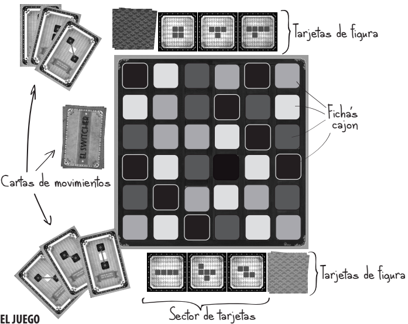
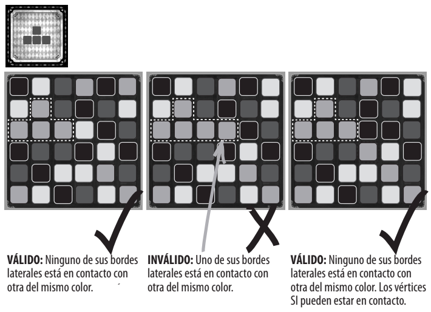
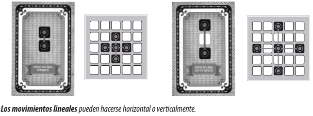
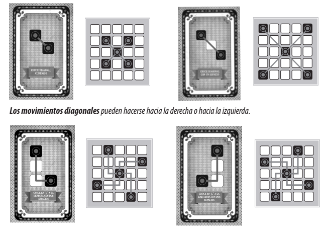
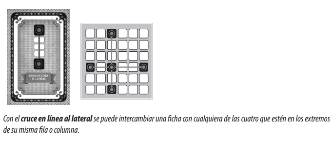

# Take Home: El switcher

- Día de entrega de TH: 29 de agosto de 2024, hasta antes de las 23:55 hs.

# Reglas del Proyecto
En el siguiente link se encontrarán las [Reglas del Proyecto](https://drive.google.com/file/d/1NUPVsKq70hufAcZ-rBdqREBWOaAFtopx/view).

---

# Reglamento del Juego
Se hará distinción de lo que quiere el Owner y del juego base.

- Cantidad de jugadores: 2 a 4.

## Contenido

* 36 fichas cajón de cuatro colores distintos.
* 49 cartas de movimiento.
* 4 mazos de 23 tarjetas figura.
* 1 tablero de 6x6.

## El juego
El objetivo del juego es formar todas las figuras del mazo en el tablero. Para ello se moverán las fichas cajón por medio de las cartas de movimiento. Quien primero logre formar todas las figuras de su mazo será el ganador.

## Comienzo
Para comenzar la partida se deben mezclar las 36 fichas cajón y disponerlas en el tablero de manera aleatoria.
Cada jugador tomará uno de los cuatro mazos de tarjetas figuras y lo colocará boca abajo frente suyo. Dará vuelta las tres primeras tarjetas de su mazo a la vista de todos. Se repartirán tres cartas de movimiento a cada jugador. Cada jugador solo podrá ver sus propias cartas de movimiento. El jugador que haya propuesto jugar comenzará la partida.

- <mark>En este caso el Owner propone que cada mazo que se reparte se divida de forma equitativa entre la cantidad de personas que van a jugar, de tal forma que se tengan la misma cantidad de tarjetas figuras blancas y celestes.</mark>

- <mark>En este caso el Owner propone que el órden de los jugadores se sortee. </mark>

## El turno
El jugador tiene dos minutos para utilizar sus tres movimientos. En este tiempo intentará formar con las fichas cajón alguna de las figuras que estén a la vista en los sectores de tarjetas en la mesa , suyas o de sus contrincantes. El jugador mostrará la carta de movimiento a utilizar, realizará el movimiento en el tablero y luego se descartará de la carta de movimiento utilizada. Si consigue formar una figura propia, se descartará de esa tarjeta y dará vuelta la siguiente tarjeta de su mazo. Si consigue formar alguna figura de un contrincante, éste deberá darla vuelta boca abajo conviertiéndola así en una gura bloqueada. Una vez que termine su tiempo o sus cartas de moviento dará por terminado su juego: tomará del mazo de cartas de movimiento las necesarias para completar sus 3 cartas en la mano y pasará el turno al jugador de su derecha.

- <mark>En este caso el Owner propone que se puede saltear el turno del jugador.<mark>
- <mark>En este caso el Owner propone que en el primer turno **NO** tiene color bloqueante.</mark>

## Figuras

### Figuras Válidas
Una figura se considera __figura válida__ cuándo:
 - Regla 1: Las fichas cajón que la forman son todas del mismo color.
 - Regla 2: Ninguno de sus bordes laterales está en contacto con otra del mismo color.
 - Regla 3: El color de la ficha cajón no fue utilizado para formar la última figura (ya sea por él mismo o por el jugador anterior)

#### Ejemplo

#### Aclaraciones:
- Si alguna de las guras en juego ya está formada sobre la mesa cuando se da vuelta la tarjeta, se aceptará como figura válida siempre y cuando no sea del último color utilizado (Regla 3). Este también es el caso para una figura ya utilizada que permanece armada en el tablero. 

- Si un jugador logra formar una gura que aparece en más de una tarjeta en la mesa, deberá elegir una, para descartarse si es propia o convertir en gura bloqueada si es ajena.

- El jugador podrá formar tanta figuras válidas como pueda con cada movimiento. De acuerdo a su estrategia deberá decidir lo que es mejor para su juego: deshacerse de muchas tarjetas en un turno, bloquear tarjetas ajenas esperar que otro jugador la deje armada, etc.

- Una vez que se utilizen todas las cartas de movimiento, se mezclarán las cartas ya utilizadas y se formará
nuevamente un mazo.

- Los dibujos en los casilleros del tablero no tienen ninguna incidencia directa en el juego. Su existencia prueba la relación directa entre el juego y el placer estético.

### Figura bloqueada
Cuando un jugador forma una figura ajena en el tablero, el dueño de la tarjeta deberá darla vuelta y así se convierte en una figura bloqueada. Un jugador con una figura bloqueada en su sector perderá el derecho a reposición de tarjeta hasta tanto no forme todas las figuras de su sector de tarjetas. Sin embargo no perderá el derecho a bloquear figuras a los otros jugadores.

#### Ejemplo
Ej: Un jugador tiene en su sector la figura A, B y C. Otro jugador le bloquea la figura A. El jugador ahora tiene en su sector de tarjetas sólo dos figuras a la vista de todos: la B y la C. Si logra formar alguna de sus figuras (la B por ejemplo) quedará con una sola tarjeta de figura a la vista -la C- y otra dada vuelta: la figura bloqueada (la A). Cuando forme la figura C podrá dar vuelta la figura bloqueada (A) y recién cuando forme la figura A (la única que tendrá en su sector) podrá reponer las tres tarjetas en su sector y retomar el derecho a reposición normal del juego.

No se podrá bloquear más de una carta figura por vez a cada jugador, ni se podrá bloquear a un jugador que tenga una sola carta en su sector de tarjetas.

## Cartas de movimiento
Las cartas de movimientos son la forma que tienen los jugadores de mover las fichas cajón en el tablero. Los movimientos se realizan intercambiando de lugar las fichas como lo indica cada carta.

## Final del Juego
El primer jugador que logre armar todas las tarjetas de figura de su mazo será el ganador. La partida se considerará finalizada inmediatamente después que el jugador arme la última figura en el tablero.

 

# Notas de clase

**Alcance del proyecto**: Desde lo general a lo particular.

- Se puede itemizar el alcance, pero no debería serlo de forma totalitaria.

- El alcance suele ser algo corto.

- Que cosas entran: lo que está dentro del proyecto
- Que no entra: No un listado que no hace falta, sino que cosas tendremos en cuenta para el proyecto.

EL ALCANCE LO ES TODO.

**DFD**: Completo

**Diagrama de clases**: Se pide el diagrama de clases completo del proyecto.

**Casos de uso a entregar**:
- Crear partida.
- Turno completo.
- Bloqueo y desbloqueo de figura.

Estas cosas que se están pidiendo son distintas vistas del proyecto, se tienen que correlacionar. 

**Reglas del juego**:
- Jugadores: de 2 a 4.
- Se hace una distribución aleatoria de todos las tarjetas de colores en el tablero.
- Hay 4 colores de tarjetas.
- A cada jugador se le reparten fichas con formas y colores de fondo distinto. (Las que tienen fondo blanco dificiles; fondo azul fáciles)
- No podemos ver el mazo repartido de las fichas.
- Inicialmente, tenemos 3 cartas con indicaciones (fichas de movimiento) que se deben cumplir (cruces):
    - Primero movimiento: Swapeo. Se puede cambiar el sentido para el swapeo tanto vertical como horizontal.
    - Segundo movimiento: Swapeo en L. Se puede cambiar el sentido para el swapeo tanto vertical como horizontal.
- Tenemos colores bloqueados (Las tarjetas de colores se pueden bloquear).

- Cuando un jugador inicia su turno da vuelta 3 de sus cartas.
- Sólo se pueden dar vueltas 3 cartas a la vez
- Objetivo: Descartar todo el mazo personal.
- Cada jugador tiene un tiempo límite. No hay límite de turnos pero hay límite de tiempo.

 

## Reglas del juego

- La idea es formar las figuras que están en las tarjetas de colores.
- No se pueden utilizar cartas de movimiento y no formar alguna figura. En el caso de no formar la figura, se vuelve al estado inicial antes de mover las fichas.
- No se puede jugar tablero pacman.

- La figura debe ser exacta, no puede tener ni de más ni de menos fichas.
- Un color se bloquea cuando formo una figura con ese color. Es bloqueado para todos los jugadores.
- En el caso de formar dos colores se debe elegir un color para bloquear. Y se pausa el otro color

- Cuando el juego inicia no hay colores prohibidos.

- Cuando realizo movimientos y al final no tiene sentido lo que hice, vuelvo al estado inicial. Es como: 0- 1 --- 2 --- 3 --- NOTHING => 0

- Algo que se debe chequear siempre es el color válido para considerar que se armó la figura.

- Se sortea el primer jugador.

- El turno se termina o bien cuando termina el tiempo o bien cuando utilizo mis 3 cartas de movimientos.

- Cada vez que empieza mi turno, se me reponen hasta completar las 3. Si no las he utilizado en el turno anterior se mantienen.

- No se pueden mover las fichas para para romper el tablero de alguien más.

- Armar una figura es un procedimiento en el cual es válido mediante una secuencia. Como por ejemplo 1---2---3---4 todas las secuencias llevaron  a la figura por ende son válidas.

- Puedo saltear mi turno.

- El turno siempre se tiene 3 cartas de movimiento y 3 de figura.

- Las cartas de movimiento son infinitas.

- Si tenemos todos la misma figura, el jugador que la construya puede bloquearsela a un jugador. Un jugador puede tener una carta bloqueada por vez.

- Si me queda una carta sola para formar, no me pueden bloquear.

- Se puede bloquear si y sólo si tengo al menos 2 cartas.

- Si estoy bloqueado no me puedo reponer figuras hasta que elimine todas las que están disponibles. Una vez elimino las figuras disponibles se habilita la bloqueada y luego de formar la bloqueada se reponen más.

- El color prohibido se convierte en la ficha que formaste.

- Tiene que haber un chat para interactuar.

- Formar figuras tiene acciones: bloqueo o descartar la carta.

- Hay un mazo de descarte de movimiento y de figuras.

- Se reparten todas las cartas de jugadores (En el juego son 9 y 9) pero teniendo en cuenta que sea equitativo en el sentido de X cantidad de azules y blancas.

- El juego acaba con 1 ganador.
- El puntaje es restar la cantidad de figuras a medida que se van formando.

- 2 MINUTOS por turno.

- Al formar una figura se debe indicar una acción: BLOQUEAR O DESCARTAR.

- Las cartas se reponen al terminar el turno.

## Pedido del owner

- El orden de TODOS los jugadores se sortea.

- Poder jugar al switcher a través de la web con otros jugadores. Es decir poder jugarlo online.

- Que algún jugador pueda crear partidas y que otros jugadores puedan unirse.

- Gana el juego el que se queda sin figuras a armar.

- Salas de partidas.

- Para entrar a una sala necesito un nombre de usuario.
