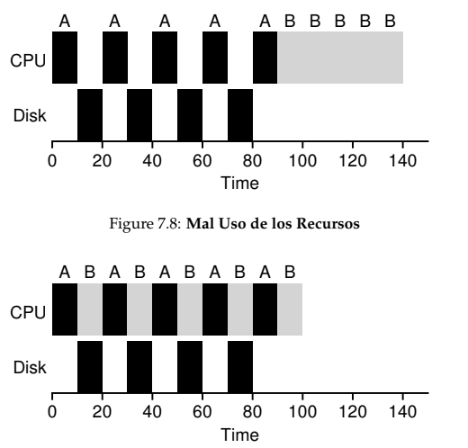
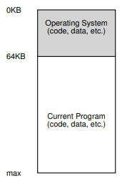
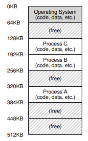

# 💻 Teórico de Sistemas Operativos 💾

En este archivo encontrarás un resumen o algunas ideas sobre el libro OSTEP (Operating Systems: Three Easy Pieces) y otros temas relacionados con sistemas operativos.

Como la materia se divide en 3 partes, también dividiré este archivo en 3 partes, una para cada parte del libro.

Enjoy :D

# Indice

- [Introducción](#introducción)
  - [Introducción a los Sistemas Operativos](#introducción-a-los-sistemas-operativos)
  - [Virtualizando la CPU](#virtualizando-la-cpu)
  - [Virtualizando la Memoria](#virtualizando-la-memoria)
  - [Concurrencia](#concurrencia)
  - [Persistencia](#persistencia)
  - [Desiciones de diseño](#desiciones-de-diseño)
  - [Un poco de historia](#un-poco-de-historia)
- [Virtualización](#virtualizacion)
  - [Dialogo](#dialogo)
  - [Procesos](#procesos)
  - [Interludio: API de procesos](#interludio-api-de-procesos)
  - [Ejecución Directa Limitada](#ejecución-directa-limitada)
  - [Planificación de la CPU](#planificación-de-la-cpu)

# Introducción

Las tres piezas fáciles se refieren a los tres elementos temáticos principales en los que se organiza el libro: virtualización, concurrencia y persistencia. Al discutir estos conceptos, terminaremos hablando de la mayoría de las cosas importantes que hace un sistema operativo; con suerte, también se divertirán en el camino.

- El primero es el `crux` del problema. Cada vez que tratamos de resolver un problema, primero intentamos declarar cuál es el tema más importante; dicho crux del problema se señala explícitamente en el texto, y esperamos que se resuelva a través de las técnicas, algoritmos e ideas presentadas en el resto del texto.
- En muchos lugares, explicaremos cómo funciona un sistema mostrando su comportamiento a lo largo del tiempo. Estas líneas de tiempo son la esencia de la comprensión; si sabes qué ocurre, estarás en camino a entender verdaderamente cómo opera la memoria virtual.

- Si comprendes lo que sucede cuando un sistema de archivos con journaling escribe un bloque en el disco, habrás dado los primeros pasos hacia el dominio de los sistemas de almacenamiento.

- Al principio de cada sección principal, primero presentaremos una `abstracción` que un sistema operativo proporciona, y luego trabajaremos en los capítulos siguientes sobre los mecanismos, políticas y otros apoyos necesarios para proporcionar esa abstracción.
  - Las abstracciones son fundamentales en todos los aspectos de la Ciencia de la Computación, por lo que no es sorprendente que también sean esenciales en los sistemas operativos.

> **Consejo**: Asiste a clase, para escuchar al profesor presentar el material. Luego, al final de cada semana, lee estas notas, para ayudar a que las ideas se asienten un poco mejor en tu mente. Por supuesto, algún tiempo después (pista: antes del examen), vuelve a leer las notas para consolidar tu conocimiento. Por supuesto, tu profesor sin duda asignará algunas tareas y proyectos, así que deberías hacerlos; en particular, hacer proyectos donde escribas código real para resolver problemas reales es la mejor manera de poner en práctica las ideas de estas notas.

## Introducción a los Sistemas Operativos

> **El CRUX del problema: Cómo virtualizar los recursos**: El porqué el sistema operativo hace esto no es la pregunta principal, ya que la respuesta debería ser obvia: hace que el sistema sea más fácil de usar. Por lo tanto, nos enfocamos en el cómo: ¿qué mecanismos y políticas implementa el sistema operativo para lograr la virtualización? ¿Cómo lo hace de manera eficiente? ¿Qué soporte de hardware es necesario?

### Virtualizando la CPU

Si sólo tenemos un procesador ¿Cómo ocurre la magia de correr programas al mismo tiempo? Resulta que el sistema operativo, con algo de ayuda del hardware, es el encargado de crear esta ilusión, es decir, la ilusión de que el sistema tiene un número muy grande de CPUs virtuales. Convertir un solo CPU (o un pequeño conjunto de ellos) en un número aparentemente infinito de CPUs y, por lo tanto, permitir que muchos programas se ejecuten aparentemente al mismo tiempo es lo que llamamos virtualización de la CPU.

Por supuesto, para ejecutar programas, detenerlos y, en general, indicarle al sistema operativo qué programas ejecutar, deben existir algunas interfaces (APIs) que puedes usar para comunicar tus deseos al sistema operativo. Hablaremos sobre estas APIs a lo largo del libro; de hecho, son la principal forma en que la mayoría de los usuarios interactúa con los sistemas operativos.

### Virtualizando la Memoria

Ahora consideremos la memoria. El modelo de memoria física presentado por las máquinas modernas es muy simple. La memoria es simplemente un array de bytes; para leer la memoria, se debe especificar una dirección para poder acceder a los datos almacenados allí; para escribir (o actualizar) memoria, también se debe especificar los datos a escribir en la dirección dada.

La memoria se accede todo el tiempo cuando un programa está en ejecución. Un programa mantiene todas sus estructuras de datos en memoria y accede a ellas mediante diversas instrucciones, como cargas y almacenamientos, o otras instrucciones explícitas que acceden a la memoria para realizar su trabajo. No olvides que cada instrucción del programa también está en memoria; por lo tanto, la memoria se accede en cada recuperación de instrucción.

```C
#include <unistd.h>
#include <stdio.h>
#include <stdlib.h>
#include <assert.h>
#include <sys/time.h>
#include <time.h>

void Spin(int seconds) {
    time_t start = time(NULL);
    while (time(NULL) - start < seconds) {
        // Bucle vacío que consume tiempo
    }
}

int main(int argc, char *argv[]){
    int *p = malloc(sizeof(int)); // a1
    assert(p != NULL);
    printf("(%d) address pointed to by p: %p\n", getpid(), p); // a2
    *p = 0; // a3
    while (1) {
        Spin(1);
        *p = *p + 1;
        printf("(%d) p: %d\n", getpid(), *p); // a4
    }
    return 0;
}
```

El programa hace un par de cosas. Primero, asigna algo de memoria (línea a1). Luego, imprime la dirección de la memoria (a2) y, a continuación, coloca el número cero en la primera posición de la memoria recién asignada (a3). Finalmente, entra en un bucle, retrasándose durante un segundo e incrementando el valor almacenado en la dirección contenida en p. Con cada declaración de impresión, también muestra lo que se llama el identificador del proceso (PID) del programa en ejecución. Este PID es único para cada proceso en ejecución. Nuevamente, este primer resultado no es muy interesante. La memoria recién asignada está en la dirección 0x200000. A medida que el programa se ejecuta, actualiza lentamente el valor y muestra el resultado.

```bash
$ gcc -o mem mem.c
[1] 15998
(15999) address pointed to by p: 0x5b34db0ce2a0
(15998) address pointed to by p: 0x578a0f4c02a0
(15999) p: 1
(15998) p: 1
(15998) p: 2
(15999) p: 2
(15999) p: 3
(15998) p: 3
(15999) p: 4
(15998) p: 4
(15999) p: 5
(15998) p: 5
(15998) p: 6
(15999) p: 6
(15999) p: 7
(15998) p: 7
(15998) p: 8
(15999) p: 8
(15999) p: 9
(15998) p: 9

```

Ahora, ejecutamos varias instancias de este mismo programa para ver qué sucede (Figura 2.4). Vemos en el ejemplo que cada programa en ejecución ha asignado memoria en la misma dirección (0x578a0f4c02a0), ¡y sin embargo, cada uno parece estar actualizando el valor en 0x578a0f4c02a0 de forma independiente! Es como si cada programa en ejecución tuviera su propia memoria privada, en lugar de compartir la misma memoria física con otros programas en ejecución. De hecho, eso es exactamente lo que está sucediendo aquí, ya que el sistema operativo está virtualizando la memoria. Cada proceso accede a su propio espacio de direcciones virtuales privado (a veces simplemente llamado su espacio de direcciones), que el sistema operativo mapea de alguna manera a la memoria física de la máquina. Una referencia de memoria dentro de un programa en ejecución no afecta el espacio de direcciones de otros procesos (o del propio sistema operativo); en lo que respecta al programa en ejecución, tiene la memoria física solo para sí mismo. La realidad, sin embargo, es que la memoria física es un recurso compartido, gestionado por el sistema operativo.

### Concurrencia

Usamos este término conceptual para referirnos a una serie de problemas que surgen y deben ser abordados cuando se trabaja en muchas cosas al mismo tiempo (es decir, concurrentemente) en el mismo programa. Los problemas de concurrencia surgieron primero dentro del propio sistema operativo; como puedes ver en los ejemplos anteriores sobre virtualización, el sistema operativo está manejando muchas cosas a la vez, ejecutando primero un proceso, luego otro, y así sucesivamente. Resulta que hacer esto lleva a problemas profundos e interesantes

> El CRUX del problema:
> Cuando hay muchos hilos ejecutándose concurrentemente dentro del mismo espacio de memoria, ¿cómo podemos construir un programa que funcione correctamente? ¿Qué primitivas se necesitan del sistema operativo? ¿Qué mecanismos deben proporcionar el hardware? ¿Cómo podemos usarlos para resolver los problemas de concurrencia?

### Persistencia

El tercer tema principal del curso es la persistencia. En la memoria del sistema, los datos pueden perderse fácilmente, ya que dispositivos como la DRAM almacenan valores de manera volátil; cuando se corta la energía o el sistema falla, cualquier dato en memoria se pierde. Por lo tanto, necesitamos hardware y software capaces de almacenar datos de manera persistente.

El software en el sistema operativo que generalmente gestiona el disco se llama el sistema de archivos; por lo tanto, es responsable de almacenar cualquier archivo que el usuario cree de manera confiable y eficiente en los discos del sistema.

A diferencia de las abstracciones proporcionadas por el sistema operativo para la CPU y la memoria, el sistema operativo no crea un disco virtualizado privado para cada aplicación. Más bien, se asume que, a menudo, los usuarios querrán compartir información que está en archivos.

### Desiciones de diseño

Un objetivo en el diseño e implementación de un sistema operativo es proporcionar un alto rendimiento; otra forma de decirlo es que nuestro objetivo es minimizar los sobrecostos del OS.

Otro objetivo será proporcionar protección entre aplicaciones, así como entre el OS y las aplicaciones. Debido a que queremos permitir que muchos programas se ejecuten al mismo tiempo, queremos asegurarnos de que el comportamiento malicioso o accidentalmente incorrecto de uno no dañe a los demás; ciertamente no queremos que una aplicación pueda dañar el propio OS (ya que eso afectaría a todos los programas que se ejecutan en el sistema). La protección es el corazón de uno de los principales principios subyacentes de un sistema operativo, que es el de aislamiento; aislar procesos unos de otros es clave para la protección y, por lo tanto, subyace en gran parte de lo que un OS debe hacer.

### Un poco de historia

#### Primeros Sistemas Operativos: Solo Bibliotecas

En sus inicios, los sistemas operativos (OS) eran bastante rudimentarios, funcionando esencialmente como bibliotecas de funciones comunes. En lugar de que cada programador escribiera código para manejar I/O de bajo nivel, el "OS" proporcionaba APIs para facilitar el desarrollo. En estos sistemas de mainframe antiguos, solo se ejecutaba un programa a la vez, controlado por un operador humano. Mucho de lo que hoy consideramos funciones básicas de un OS (como decidir el orden de ejecución de trabajos) lo hacía este operador. Este modo de procesamiento se conocía como procesamiento por lotes (batch processing), donde una serie de trabajos se configuraban y se ejecutaban en "lote" por el operador. Dado que era costoso permitir que un usuario interactuara directamente con la computadora, se utilizaba principalmente el procesamiento por lotes [BH00].

#### Más Allá de las Bibliotecas: Protección

A medida que los sistemas operativos evolucionaron, asumieron un papel más central en la gestión de las máquinas. Un aspecto importante fue reconocer que el código ejecutado en nombre del OS debía ser especial y tratado de manera diferente al código de aplicación normal. Permitir que cualquier aplicación leyera cualquier archivo en el disco comprometía la privacidad. Por lo tanto, se inventó la llamada a sistema (system call), un mecanismo que permitió la transición controlada al OS, elevando el nivel de privilegio del hardware. En contraste con una llamada a procedimiento, una llamada a sistema transfiere el control al OS mientras eleva el nivel de privilegio del hardware. Esto permitió al OS tener acceso completo al hardware y realizar operaciones como solicitudes de I/O o gestionar memoria. Una vez completada la solicitud, el control se devuelve al usuario.

#### La Era del Multiprogramming

Con la llegada de las minicomputadoras, los sistemas operativos dieron un gran salto. Las máquinas clásicas como la PDP de Digital Equipment hicieron que las computadoras fueran más asequibles, permitiendo que un grupo menor de personas dentro de una organización tuviera su propia máquina. Esto impulsó la actividad de desarrollo y la innovación en los sistemas operativos, especialmente con la multiprogramación. En lugar de ejecutar un solo trabajo a la vez, el OS cargaba múltiples trabajos en memoria y cambiaba rápidamente entre ellos para mejorar la utilización del CPU. La necesidad de soportar multiprogramación y la superposición en presencia de I/O e interrupciones llevó a importantes innovaciones en la protección de memoria y el manejo de la concurrencia. La introducción del sistema operativo UNIX por Ken Thompson y Dennis Ritchie en Bell Labs fue un avance significativo, al simplificar y hacer más accesibles muchas ideas buenas de otros sistemas [O72, B+72, S68].

#### La Era Moderna

La llegada de las computadoras personales (PC) marcó una nueva era en la informática. Las primeras PCs, como el Apple II y el IBM PC, se convirtieron en la fuerza dominante en la computación debido a su bajo costo. Sin embargo, los primeros sistemas operativos de PC, como DOS, olvidaron o nunca aprendieron las lecciones de las minicomputadoras, como la protección de memoria. Los primeros sistemas operativos de Mac (hasta la versión 9) tenían un enfoque cooperativo para la programación, lo que permitía que un hilo atrapado en un bucle infinito pudiera tomar el control completo del sistema. Afortunadamente, con el tiempo, las características avanzadas de los sistemas operativos de minicomputadoras comenzaron a integrarse en los sistemas de escritorio. Hoy en día, sistemas como macOS, basado en UNIX, y Windows NT han adoptado muchas de las grandes ideas de la historia de la computación. Incluso los teléfonos móviles modernos, que ejecutan sistemas operativos como Linux, se asemejan más a los sistemas de minicomputadoras de los años 70 que a los PC de los años 80. Es gratificante ver cómo las buenas ideas del pasado continúan evolucionando y mejorando los sistemas modernos.

#### ASIDE: La importancia de UNIX

Es difícil exagerar la importancia de UNIX en la historia de los sistemas operativos. Influenciado por sistemas anteriores, en particular el famoso sistema Multics del MIT, UNIX reunió muchas ideas innovadoras y creó un sistema tanto simple como poderoso. El principio unificador subyacente al UNIX original de "Bell Labs" era la construcción de pequeños programas potentes que podían conectarse entre sí para formar flujos de trabajo más grandes. El shell, donde se escriben los comandos, proporcionaba primitivas como los pipes (tuberías) para habilitar tal programación a nivel meta, facilitando la conexión de programas para lograr una tarea más compleja.

Por ejemplo, para encontrar líneas en un archivo de texto que contengan la palabra "foo" y luego contar cuántas de esas líneas existen, se escribiría: grep foo file.txt | wc -l, utilizando así los programas grep y wc (word count) para cumplir la tarea. El entorno UNIX era amigable tanto para programadores como para desarrolladores, proporcionando también un compilador para el nuevo lenguaje de programación C. Facilitar que los programadores escribieran sus propios programas, así como compartirlos, hizo que UNIX se volviera enormemente popular. Probablemente también ayudó mucho que los autores distribuyeran copias gratuitamente a quien las solicitara, una forma temprana de software de código abierto.

Otra de las características críticas fue la accesibilidad y legibilidad del código. Tener un kernel hermoso y pequeño escrito en C invitaba a otros a jugar con él, agregando nuevas y geniales funcionalidades. Por ejemplo, un grupo emprendedor en Berkeley, liderado por Bill Joy, creó una maravillosa distribución (la Berkeley Systems Distribution, o BSD) que incluía subsistemas avanzados de memoria virtual, sistemas de archivos y redes. Joy luego cofundó Sun Microsystems.

Desafortunadamente, la expansión de UNIX se vio un poco frenada cuando algunas empresas intentaron reclamar su propiedad y lucrar con él, un resultado desafortunado (pero común) cuando los abogados se involucran. Muchas empresas desarrollaron sus propias variantes: SunOS de Sun Microsystems, AIX de IBM, HPUX (conocido como "H-Pucks") de HP, e IRIX de SGI. Las disputas legales entre AT&T/Bell Labs y estos otros actores arrojaron una sombra sobre UNIX, y muchos se preguntaban si sobreviviría, especialmente con la introducción de Windows, que se apoderó de gran parte del mercado de PCs...

#### ASIDE: Y luego llegó Linux

Afortunadamente para UNIX, un joven hacker finlandés llamado Linus Torvalds decidió escribir su propia versión de UNIX, la cual se basaba en gran medida en los principios e ideas del sistema original, pero no en su base de código, evitando así problemas legales. Torvalds contó con la ayuda de muchas personas de todo el mundo y aprovechó las sofisticadas herramientas GNU que ya existían [G85], y pronto nació Linux (así como el movimiento moderno de software de código abierto).

Con la llegada de la era de internet, la mayoría de las empresas (como Google, Amazon, Facebook y otras) optaron por usar Linux, ya que era gratuito y podía modificarse fácilmente para satisfacer sus necesidades; de hecho, es difícil imaginar el éxito de estas nuevas compañías si un sistema así no hubiera existido. A medida que los teléfonos inteligentes se convirtieron en una plataforma dominante para los usuarios, Linux también encontró un bastión allí (a través de Android), por muchas de las mismas razones. Además, Steve Jobs llevó consigo su entorno operativo basado en UNIX, NeXTStep, a Apple, lo que hizo que UNIX fuera popular en los escritorios (aunque muchos usuarios de la tecnología de Apple probablemente no sean conscientes de este hecho).

Así, UNIX sigue vivo, más importante hoy que nunca. Los dioses de la computación, si crees en ellos, deberían ser agradecidos por este maravilloso resultado.

# Virtualización de la CPU

## Procesos

Definición informal: Programa en ejecución

El programa en sí mismo es una cosa sin vida: solo está allí en el disco, un monton de instrucciones (y quizás ́algunos datos estáticos), esperando entrar en acción. Es el sistema ́operativo el que toma estos bytes y los pone en marcha, transformando el programa en algo util.

---

### El problema en cuestión:

¿Cómo proporcionar la ilusión de muchas CPU's? A pesar de que solo hay unas pocas CPUs físicas disponibles, ¿Como puede el sistema operativo proporcionar la ilusion de un suministro casi infinito de dichas CPUs?

---

El sistema operativo crea esta ilusión **virtualizando** la CPU.

Al ejecutar un proceso, detenerlo y luego ejecutar otro, y así sucesivamente, el OS puede promover la ilusión de que existen muchas CPUs virtuales cuando en realidad solo hay una CPU física (o algunas). Esta técnica básica, conocida como compartición de tiempo (time sharing) de la CPU, permite a los usuarios ejecutar tantos procesos concurrentes como deseen; el costo potencial es el rendimiento, ya que cada proceso se ejecutará más lentamente si la(s) CPU(s) deben compartirse.

---

### TIP: Usar time sharing (space sharing)

El tiempo compartido es una tecnica básica usada por un SO para compartir un recurso. Al permitir que el recurso sea usado un ratito por una entidad y luego otro ratito por otra, y así sucesivamente, el recurso en cuestion (por ejemplo, la CPU, o un enlace de una red) puede ser compartido por muchos. La contrapartida del tiempo compartido es el espacio compartido, donde un recurso se divide (en el espacio) entre aquellos que deseen utilizarlo. Por ejemplo, el espacio en disco es naturalmente un recurso de espacio compartido; una vez que se asigna un bloque a un archivo, normalmente no se asigna a otro archivo hasta que el usuario elimina el archivo original.

---

Para implementar la virtualizacion de la CPU, y para implementarla bien, el SO necesitara tanto maquinaria de bajo nivel como inteligencia de alto nivel. A la maquinaria de bajo nivel la llamamos mecanismos; los mecanismos son métodos o protocolos de bajo nivel que implementan una parte de la funcionalidad necesaria. Por ejemplo, mas adelante aprenderemos cómo implementar un ́cambio de contexto, que le da al SO la capacidad de dejar de ejecutar un pro- grama y empezar a ejecutar otro en una CPU determinada.

Encima de estos mecanismos reside parte de la inteligencia del SO, en forma de políticas. Las políticas son algoritmos para tomar algun tipo de decisión dentro del SO. Por ejemplo, dado un número de programas posibles para ejecutar en una CPU, ¿que programa debería ejecutar el SO? Una política de planificación en el SO tomará esta decision, probablemente utilizando información histórica (por ejemplo, ¿que programa se ha ejecutado más en el ultimo minuto?), conocimiento de la carga de trabajo (por ejemplo, que tipos de programas se ejecutan) y metricas de rendimiento (por ejemplo, ¿el sistema esta optimizando el rendimiento interactivo o el rendimiento de procesamiento?) para tomar su decision.

### La abstracción: Un proceso

Para entender lo que constituye un **proceso**, tenemos que entender su estado: lo que un programa puede leer o actualizar cuando se está ejecutando.

- Un componente obvio del estado que comprende un proceso es su memoria. Las instrucciones se encuentran en la memoria; los datos que el programa en ejecución lee y escribe también se encuentran en la memoria. El proceso puede direccionar la memoria (**espacio de direcciones**).

- Los registros forman parte del estado de un proceso; muchas instrucciones leen o actualizan explícitamente los registros y, por lo tanto, es evidente que son importantes para la ejecución del proceso.

---

### Tip: Separar políticas y mecanismos

En muchos sistemas operativos, un paradigma de diseño común es **separar** las políticas de alto nivel de sus mecanismos de bajo nivel.

- Se puede pensar en el **mecanismo** como una forma de proporcionar la respuesta del `cómo` sobre un sistema; por ejemplo, ¿cómo realiza un sistema operativo un cambio de contexto?
- La política proporciona la respuesta del `cuál`; por ejemplo, ¿cuál proceso deber ́ıa ejecutar el sistema operativo en este momento? Separarlos permite cambiar facilmente las políticas sin tener que repensar el mecanismo y, por lo tanto, es una forma de modularidad, un principio general de diseño de software.

---

Registros importantes que forman parte del estado de un proceso:

- **Program Counter**.
- **Stack Pointer**.
- **Frame Pointer**.

Los programas también suelen acceder a dispositivos de almacenamiento persistente.

### La API de los procesos

- Crear: método para crear procesos.
- Destruir: destrucción forzosa de procesos.
- Esperar: A veces es útil esperar a que un proceso deje de ejecutarse, se suele proporcionar algún tipo de interfaz de espera.
- Controles varios: Hay otros tipos de control posibles, entre ellos suspender un proceso para luego reanudarlo, enviar señales a un proceso, etc.
- Estado: Normalmente también hay interfaces para obtener información sobre el estado de un proceso, como el tiempo que lleva en ejecución o el estado en el que se encuentra.

### Creación de procesos: Un poco más detallado

Lo primero que el OS debe hacer para ejecutar un programa es cargar su código y cualquier dato estático (por ejemplo, variables inicializadas) en la memoria, dentro del espacio de direcciones del proceso. Los programas residen inicialmente en el disco (o, en algunos sistemas modernos, en SSDs basados en flash) en algún tipo de formato ejecutable; por lo tanto, el proceso de cargar un programa y datos estáticos en la memoria requiere que el OS lea esos bytes del disco y los coloque en algún lugar de la memoria.

En los primeros (o simples) sistemas operativos, el proceso de carga se realizaba de manera **eager** (apresurada), es decir, todo de una vez antes de ejecutar el programa.

Los sistemas operativos modernos realizan el proceso de forma "lazy" (perezoso), es decir, cargando piezas de código o datos solo cuando son necesarios durante la ejecución del programa.

Para comprender realmente cómo funciona la carga "lazy" de piezas de código y datos, tendrás que entender más sobre los mecanismos de paginación e intercambio (paging and swapping)

Antes de ejecutar cualquier cosa, el OS claramente debe hacer algo de trabajo para llevar los bits importantes del programa desde el disco hasta la memoria.

Una vez que el código y los datos estáticos están cargados en la memoria, hay algunas otras cosas que el OS necesita hacer antes de ejecutar el proceso. Se debe asignar algo de memoria para la pila de ejecución del programa (o simplemente stack).

El OS también puede asignar algo de memoria para el heap del programa. En los programas en C, el heap se utiliza para datos que se solicitan dinámicamente de manera explícita; los programas solicitan dicho espacio llamando a `malloc()` y lo liberan llamando a `free()`. El heap es necesario para estructuras de datos como listas enlazadas, tablas hash, árboles y otras estructuras de datos interesantes. El heap será pequeño al principio; a medida que el programa se ejecuta y solicita más memoria a través de la API de la biblioteca `malloc()`, el OS puede intervenir y asignar más memoria al proceso para ayudar a satisfacer dichas solicitudes.

- El OS también realizará algunas tareas de inicialización adicionales, particularmente relacionadas con la entrada/salida (I/O)

Al cargar el código y los datos estáticos en la memoria, al crear e inicializar una pila y al realizar otras tareas relacionadas con la configuración de I/O, el OS finalmente ha preparado el escenario para la ejecución del programa. Ahora le queda una última tarea: iniciar la ejecución del programa en su punto de entrada, es decir, en `main()`. Al saltar a la rutina `main()`, el OS transfiere el control de la CPU al proceso recién creado, y así el programa comienza.

### Estados de los procesos

Un proceso puede estar en uno de los tres estados:

- **Running (Corriendo)**: Proceso en ejecución en un procesador. Ejecución de instrucciones.
- **Ready (Listo)**: Listo para ejecutarse, pero por algún motivo el SO no ha optado por hacerlo.
- **Blocked (Bloqueado)**: Si un proceso esta bloqueado, ha realizado algÚn tipo de operacion que hace que no este listo para ejecutarse hasta que ocurra algun otro evento.

<br>

<div align="center"></div>

<br>

Pasar de **ready** a **running** significa que un proceso ha sido **scheduled**. Ser movido de **running** a **ready** significa que el proceso va a ser **descheduled**.

Notar que hay muchas decisiones que debe tomar el SO, incluso en este ejemplo simple. Primero, el sistema tuvo que decidir ejecutar Proceso1 mientras Proceso_0 emitía una E/S; hacerlo mejora la utilizacion de los recursos al mantener la CPU ocupada. En segundo lugar, el sistema decidio no volver a cambiar a Proceso_0 cuando se completo su E/S; no está claro si esta es una buena decisión o no. Este tipo de decisiones las toma el scheduler (planificador) del sistema operativo,

### Estructura de datos

- Nuevo estado, **proceso zombie**: A veces, un sistema tendrá un estado inicial en el que se encuentra el proceso cuando se está creando. Además, un proceso podría ser colocado en un estado final donde ha salido, pero aún no ha sido limpiado.

Este estado final puede ser útil, ya que permite que otros procesos (generalmente el padre que creó el proceso) examinen el código de retorno del proceso y vean si el proceso recién finalizado se ejecutó con éxito (generalmente, los programas devuelven cero en sistemas basados en UNIX cuando han completado una tarea con éxito, y un valor distinto de cero en caso contrario). Cuando termina, el padre realizará una llamada final (por ejemplo, wait()) para esperar la finalización del hijo y también para indicar al OS que puede limpiar cualquier estructura de datos relevante que hacía referencia al proceso que ahora está extinto.

## Interludio: API de procesos

En este interludio, discutimos la creación de procesos en sistemas UNIX. UNIX presenta una de las formas más intrigantes de crear un nuevo proceso con un par de llamadas al sistema: `fork()` y `exec()`. Una tercera rutina, `wait()`, puede ser utilizada por un proceso que desee esperar a que un proceso que ha creado termine.

> CRUX: Cómo crear y controlar procesos: ¿Qué interfaces debería presentar el OS para la creación y control de procesos? ¿Cómo deberían diseñarse estas interfaces para habilitar una funcionalidad poderosa, facilidad de uso y alto rendimiento?

### fork() System Call

La llamada al sistema fork() se utiliza para crear un nuevo proceso. Sin embargo, debes estar advertido: ciertamente es la rutina más extraña que jamás llamarás. El proceso que se crea es una copia (casi) exacta del proceso que lo llamó. Específicamente, aunque ahora tiene su propia copia del espacio de direcciones (es decir, su propia memoria privada), sus propios registros, su propio PC, etc. Cuando se crea el proceso hijo, ahora hay dos procesos activos en el sistema que nos importan: el padre y el hijo. Suponiendo que estamos ejecutando en un sistema con una sola CPU (por simplicidad), en ese punto podría ejecutarse el hijo o el padre. El planificador de la CPU, un tema que discutiremos con gran detalle pronto, determina qué proceso se ejecuta en un momento dado; dado que el planificador es complejo, generalmente no podemos hacer suposiciones fuertes sobre lo que elegirá hacer, y por lo tanto, qué proceso se ejecutará primero. Este no determinismo, como resulta, conduce a algunos problemas interesantes, particularmente en programas multihilo; por lo tanto, veremos mucho más no determinismo cuando estudiemos concurrencia en la segunda parte del libro.

### The wait() System Call

Hasta ahora, no hemos hecho mucho: solo crear un hijo que imprime un mensaje y sale. A veces, resulta bastante útil que un proceso padre espere a que un proceso hijo termine lo que está haciendo. Esta tarea se logra con la llamada al sistema wait() (o su versión más completa waitpid()) En este ejemplo (p2.c), el proceso padre llama a wait() para retrasar su ejecución hasta que el hijo termine de ejecutarse. Cuando el hijo finaliza, wait() regresa el control al padre. Al agregar una llamada a wait() en el código anterior, la salida se vuelve determinista. Incluso cuando el padre se ejecuta primero, espera educadamente a que el hijo termine de ejecutarse, luego wait() regresa, y entonces el padre imprime su mensaje.

### exec() System Call

una última y crucial pieza de la API de creación de procesos es la llamada al sistema exec(). Esta llamada al sistema es útil cuando quieres ejecutar un programa que es diferente al programa llamante. Por ejemplo, llamar a fork() solo es útil si deseas seguir ejecutando copias del mismo programa. Sin embargo, a menudo deseas ejecutar un programa diferente; exec()

```C
#include <stdio.h>
#include <stdlib.h>
#include <unistd.h>
#include <string.h>
#include <sys/wait.h>

int main(int argc, char *argv[]) {
    printf("hello (pid:%d)\n", (int) getpid());
    int rc = fork();
    if (rc < 0) { // fork falló; salir
        fprintf(stderr, "fork failed\n");
        exit(1);
    } else if (rc == 0) { // hijo (nuevo proceso)
        printf("child (pid:%d)\n", (int) getpid());
        char *myargs[3];
        myargs[0] = strdup("wc"); // programa: "wc"
        myargs[1] = strdup("p3.c"); // argumento: archivo de entrada
        myargs[2] = NULL; // marcar el final del array
        execvp(myargs[0], myargs); // ejecuta word count
        printf("esto no debería imprimirse");
    } else { // el padre sigue por este camino
        int rc_wait = wait(NULL);
        printf("parent of %d (rc_wait:%d) (pid:%d)\n", rc, rc_wait, (int) getpid());
    }
    return 0;
}
```

La llamada al sistema fork() es extraña; su compañero en el crimen, exec(), tampoco es tan normal. Lo que hace: dado el nombre de un ejecutable (por ejemplo, wc), y algunos argumentos (por ejemplo, p3.c), carga el código (y datos estáticos) de ese ejecutable y sobrescribe su segmento de código actual (y datos estáticos actuales) con él; el heap, la pila y otras partes del espacio de memoria del programa se re-inicializan. Luego, el sistema operativo simplemente ejecuta ese programa, pasando cualquier argumento como el argv de ese proceso. Así, no crea un nuevo proceso; más bien, transforma el programa que se está ejecutando (anteriormente p3) en un programa diferente (wc). Después de exec() en el hijo, es casi como si p3.c nunca se hubiera ejecutado; una llamada exitosa a exec() nunca regresa.

### ¿Por qué? Motivando a la API

Por supuesto, una gran pregunta que podrías tener es: ¿por qué construir una interfaz tan extraña para lo que debería ser el acto simple de crear un nuevo proceso? Bueno, resulta que la separación de fork() y exec() es esencial para construir un shell en UNIX, porque permite que el shell ejecute código después de la llamada a fork() pero antes de la llamada a exec(). Este código puede alterar el entorno del programa que está a punto de ejecutarse, lo que permite construir fácilmente una variedad de características interesantes.

El shell es solo un programa de usuario. Te muestra un prompt y luego espera que escribas algo en él. Luego escribes un comando (es decir, el nombre de un programa ejecutable, más cualquier argumento); en la mayoría de los casos, el shell averigua dónde se encuentra el ejecutable en el sistema de archivos, llama a fork() para crear un nuevo proceso hijo que ejecute el comando, llama a alguna variante de exec() para ejecutar el comando, y luego espera a que el comando termine llamando a wait(). Cuando el hijo termina, el shell regresa de wait() y vuelve a imprimir un prompt, listo para tu próximo comando.

La separación de fork() y exec() permite al shell hacer un montón de cosas útiles con relativa facilidad. Por ejemplo:

```shell
wc p3.c > newfile.txt
```

En el ejemplo anterior, la salida del programa wc se redirige al archivo de salida newfile.txt (el signo mayor que indica dicha redirección). La forma en que el shell logra esta tarea es bastante simple: cuando se crea el hijo, antes de llamar a exec(), el shell (específicamente, el código ejecutado en el proceso hijo) cierra la salida estándar y abre el archivo newfile.txt. Al hacer esto, cualquier salida del programa que está a punto de ejecutarse, wc, se envía al archivo en lugar de a la pantalla (los descriptores de archivos abiertos se mantienen abiertos a través de la llamada a exec(), lo que permite este comportamiento).

La Figura 5.4 muestra un programa que hace exactamente esto. La razón por la que esta redirección funciona se debe a una suposición sobre cómo el sistema operativo gestiona los descriptores de archivos. Específicamente, los sistemas UNIX comienzan a buscar descriptores de archivos libres desde cero. En este caso, STDOUT_FILENO será el primero disponible y, por lo tanto, se asignará cuando se llame a open(). Las escrituras subsecuentes del proceso hijo al descriptor de archivo de salida estándar, por ejemplo, mediante rutinas como printf(), se dirigirán automáticamente al archivo recién abierto en lugar de a la pantalla.

Notarás (al menos) dos detalles interesantes sobre esta salida. Primero, cuando se ejecuta p4, parece que no ha sucedido nada; el shell simplemente imprime el prompt de comando y está inmediatamente listo para tu próximo comando. Sin embargo, ese no es el caso; el programa p4 realmente llamó a fork() para crear un nuevo hijo y luego ejecutó el programa wc mediante una llamada a execvp(). No ves ninguna salida en la pantalla porque se ha redirigido al archivo p4.output. Segundo, puedes ver que cuando usamos cat para ver el archivo de salida, se encuentra toda la salida esperada de la ejecución de wc.

Por ahora, basta con decir que la combinación de fork()/exec() es una manera poderosa de crear y manipular procesos.

### Process Control and Users

Más allá de fork(), exec() y wait(), existen muchas otras interfaces para interactuar con procesos en sistemas UNIX. Por ejemplo, la llamada al sistema kill() se utiliza para enviar señales a un proceso, incluyendo directivas para pausar, finalizar, y otras órdenes útiles. Para mayor comodidad, en la mayoría de los shells de UNIX, ciertas combinaciones de teclas están configuradas para enviar una señal específica al proceso que se está ejecutando; por ejemplo, control-c envía un SIGINT (interrupción) al proceso (normalmente terminándolo), y control-z envía una señal SIGTSTP (stop), pausando así el proceso en mitad de su ejecución (puedes reanudarlo más tarde con un comando, por ejemplo, el comando fg que se encuentra en muchos shells). Todo el subsistema de señales proporciona una infraestructura rica para entregar eventos externos a procesos, incluyendo formas de recibir y procesar esas señales dentro de procesos individuales, así como formas de enviar señales a procesos individuales o a grupos enteros de procesos.

Para utilizar esta forma de comunicación, un proceso debe usar la llamada al sistema signal() para "capturar" varias señales; al hacerlo, se asegura de que cuando una señal particular se entregue a un proceso, este suspenderá su ejecución normal y ejecutará una porción específica de código en respuesta a la señal. Puedes leer en otra parte [SR05] para aprender más sobre las señales y sus múltiples complejidades.

Esto naturalmente plantea la pregunta: ¿quién puede enviar una señal a un proceso y quién no? Generalmente, los sistemas que usamos pueden ser utilizados por múltiples personas al mismo tiempo; si una de estas personas pudiera enviar arbitrariamente señales como SIGINT (para interrumpir un proceso, probablemente terminándolo), la usabilidad y seguridad del sistema se verían comprometidas. Como resultado, los sistemas modernos incluyen una concepción sólida de la noción de un usuario.

- El usuario, después de ingresar una contraseña para establecer credenciales, inicia sesión para obtener acceso a los recursos del sistema.
- El usuario puede entonces lanzar uno o muchos procesos y ejercer control total sobre ellos (pausarlos, matarlos, etc.).
- Los usuarios generalmente solo pueden controlar sus propios procesos; es el trabajo del sistema operativo distribuir los recursos (como CPU, memoria y disco) a cada usuario (y sus procesos) para cumplir con los objetivos generales del sistema.

### Herramientas útiles

Existen muchas herramientas de línea de comandos que también son útiles. Por ejemplo, el comando ps te permite ver qué procesos están en ejecución; consulta las páginas de manual para obtener algunas banderas útiles que puedes pasar a ps. La herramienta top también es bastante útil, ya que muestra los procesos del sistema y cuántos recursos de CPU y otros están consumiendo. Curiosamente, muchas veces cuando ejecutas top, este afirma ser el que más recursos consume; quizás es un poco egocéntrico. El comando kill se puede usar para enviar señales arbitrarias a los procesos, al igual que el comando killall, que es un poco más amigable para el usuario. Asegúrate de usarlos con cuidado; si accidentalmente matas tu gestor de ventanas, la computadora frente a ti puede volverse bastante difícil de usar.

Finalmente, hay muchos tipos diferentes de medidores de CPU que puedes usar para obtener una comprensión rápida de la carga en tu sistema; por ejemplo, siempre mantenemos MenuMeters (de Raging Menace Software) funcionando en nuestras barras de herramientas de Macintosh, para que podamos ver cuánto CPU se está utilizando en cualquier momento. En general, cuanta más información tengas sobre lo que está sucediendo, mejor.

### Aside: El superusuario (ROOT)

Un sistema generalmente necesita un usuario que pueda administrar el sistema y que no esté limitado de la misma manera que la mayoría de los usuarios. Dicho usuario debería poder matar un proceso arbitrario (por ejemplo, si está abusando del sistema de alguna manera), aunque ese proceso no haya sido iniciado por este usuario. Tal usuario también debería poder ejecutar comandos poderosos como shutdown (que, como es de esperarse, apaga el sistema). En los sistemas basados en UNIX, estas habilidades especiales se otorgan al superusuario (a veces llamado root). Mientras que la mayoría de los usuarios no pueden matar los procesos de otros usuarios, el superusuario sí puede. Ser root es como ser Spider-Man: con un gran poder viene una gran responsabilidad. Por lo tanto, para aumentar la seguridad (y evitar errores costosos), generalmente es mejor ser un usuario regular; si necesitas ser root, procede con cautela, ya que todos los poderes destructivos del mundo de la computación están ahora a tu alcance.

## Ejecución Directa Limitada

### Problema #1: Operaciones restringidas

> **El crux del problema**: Un proceso debe poder realizar E/S y otras operaciones restringidas, pero sin darle al proceso un completo control sobre el sistema. ¿Como pueden el SO y el hardware trabajar juntos para lograrlo?

Un enfoque ser ́ıa simplemente dejar que cualquier proceso haga lo que quiera en terminos de E/S y otras operaciones relacionadas. Sin embargo, hacerlo evitaría la construccion de muchos tipos de sistemas que son deseables. Por ejemplo, si deseamos construir un sistema de archivos que verifique los permisos antes de otorgar acceso a un archivo, no podemos simplemente permitir que cualquier usuario emita E/Ss al disco; si lo hicieramos, un proceso podría simplemente leer o escribir el disco entero y así todas las protecciones se perderían.

Modos de procesadores:

- **Modo Kernel**: Modo en el que el SO corre. El codigo que corre puede hacer lo que quiera, incluyendo operaciones privilegiadas tales como emitir solicitudes E/S y ejecutar todo tipo de instrucciones restringidas.
- **Modo usuario**: el codigo que corre en modo usuario esta restringido en lo que puede hacer.

**¿Qué debe hacer un proceso de usuario cuando quiera realizar una operacion privilegiada, como leer del disco?** Para permitir esto, practicamente todo el hardware moderno les proporciona a los programas de usuario la capacidad de que realicen una **syscall**.

Para ejecutar una syscall, un programa debe ejecutar una instrucción **trap** especial. Esta instruccion simultáneamente salta al kernel y eleva el nivel de privilegios; una vez en el kernel, el sistema ahora puede realizar cualquier operacion privilegiada que sea necesaria (si esta permitida), y así hacer el trabajo requerido para el proceso de llamada. Cuando finaliza, el SO llama a una instrucción especial de **retorno de la trap** que, como era de esperar, vuelve al programa de usuario que realiza la llamada y, al mismo tiempo, reduce el nivel de privilegios al de modo usuario.

El Hardware debe tener un poco de cuidado al ejecutar una trap, ya que debe asegurarse de guardar suficientes registros del programa que hizo la llamada para poder regresar correctamente cuando el sistema operativo emita la instrucción del retorno a la trap.

> **Detalle de suma importancia**: ¿Como sabe la trap que código ejecutar dentro del SO? Claramente, el proceso que realiza la llamada no puede especificar una direccion a la que saltar (como lo harıa al realizar una llamada de procedimiento); hacerlo permitiría a los programas saltar a cualquier parte del kernel, lo que claramente es una Muy Mala Idea. Por lo tanto, el kernel debe controlar cuidadosamente que código se ejecuta en una instruccion trap. ́

El kernel lo hace configurando una **tabla de traps** en el momento de booteo. Cuando la maquina arranca, lo hace en modo privilegiado (kernel) y, por lo tanto, es libre de configurar el hardware de la maquina según sea necesario. Una de las primeras cosas que hace el SO es decirle al hardware que código debe ejecutar cuando ocurren ciertos eventos excepcionales. Por ejemplo, ¿que codigo debe ejecutarse cuando se produce una interrupcion del disco duro, cuando se produce una interrupcion del teclado o cuando un programa realiza una llamada al sistema? El sistema operativo informa al hardware de la ubicacion de estos gestores de traps, generalmente con algun ́tipo de instruccion especial. Una vez que se informa al hardware, recuerda la ubicacion de estas rutinas, hasta que se reinicia la máquina y, por lo tanto, el hardware sabe que hacer (es decir, a que código saltar) cuando tienen lugar las llamadas del sistema y otros eventos excepcionales.

Para especificar la syscall exacta, en general se asigna un **número de syscall a cada syscall**. Por lo tanto, el codigo de usuario es responsable de colocar el número de llamada al sistema deseado en un registro o en una ubicacion específica en el stack; el SO, al encargarse de la llamada al sistema dentro del controlador de traps, examina este número, asegura que es valido y, si lo es, ejecuta el código correspondiente. Este nivel de indireccion sirve como una forma de protección; el código de usuario no puede especificar una direccion exacta a la que saltar, sino que debe solicitar un servicio en particular a traves de un número.

Un ultimo tema aparte: poder ejecutar la instrucción para decirle al hardware donde estan las tablas de traps es una capacidad muy poderosa. Por lo tanto, como habras adivinado, también es una operacion ́privilegiada.

Hay dos fases en el protocolo de ejecucion directa limitada (LDE). En el primero (en el momento de boot), el kernel inicializa la tabla de traps y la CPU recuerda su ubicacion para su uso futuro. El kernel lo hace mediante una instruccion privilegiada.

En el segundo (cuando se ejecuta un proceso), antes de usar una instruccion de retorno de la trap para iniciar la ejecucion del proceso, el kernel configura algunas cosas (por ejemplo, asigna un nodo en la lista de procesos, asigna memoria); luego cambia la CPU a modo usuario y comienza a ejecutar el proceso. Cuando el proceso desea emitir una llamada al sistema, vuelve a entrar en el SO, que se encarga y una vez mas devuelve el control al proceso a traves de un retorno de la trap. El proceso luego completa su trabajo y retorna de main(); esto generalmente retornara a algun código auxiliar que saldrá correctamente del programa (por ejemplo, con la llamada al sistema exit(), que trapea al SO). En este punto, el sistema operativo se limpia y hemos terminado.

### Problema #2: Cambio de procesos

El siguiente problema con la ejecucion directa es lograr un intercambio de procesos. Intercambiar procesos debería ser simple, ¿verdad? El SO deber ́ıa decidir detener un proceso e iniciar otro. ¿Cual es el problema? En realidad, es un poco complicado: específicamente, si un proceso se esta ejecutando en la CPU, por definición, significa que el SO no esta corriendo. Si el SO no se está ejecutando, ¿cómo puede hacer algo? (pista: no puede). Si bien esto suena casi filosofico, es un problema real: claramente no hay forma de que el SO tome una accion si no se está ejecutando en la CPU. Llegamos así a nuestro problema.

> La cuestión: Cómo recuperar el control el control de la CPU: ¿Cómo puede el sistema operativo **recuperar el control** de la CPU para que pueda cambiar entre procesos?

#### Un enfoque cooperativo: Esperar las llamadas al sistema.

Un enfoque que han adoptado algunos sistemas en el pasado (por ejemplo, las primeras versiones del SO de Macintosh o el antiguo sistema Xerox Alto) se conoce como el enfoque cooperativo. En este estilo, el SO confía en que los procesos del sistema se comporten de manera razonable. Se supone que los procesos que se ejecutan durante demasiado tiempo ceden periodicamente la CPU para que el SO pueda decidir ejecutar alguna otra tarea. Así, podrías preguntarte, ¿como un proceso amigable cede la CPU en este mundo utopico? La mayoría de los procesos, transfieren el control de la CPU al SO con bastante frecuencia haciendo llamadas al sistema, por ejemplo, para abrir un archivo y luego leerlo, o para enviar un mensaje a otra máquina, o para crear un nuevo proceso.

Los sistemas como este a menudo incluyen una llamada al sistema explícita **yield**, que no hace nada mas que transferir el control al sistema operativo para que pueda ejecutar otros procesos. Las aplicaciones tambien transfieren el control al SO cuando hacen algo ilegal. Por ejemplo, si una aplicacion se divide por cero o intenta acceder a la memoria a la que no debería poder acceder, generara una trap al SO. El cual volvera a tener el control de la CPU (y probablemente terminara el proceso infractor). Por lo tanto, en un sistema de programacion cooperativo, el SO recupera el control de la CPU esperando una llamada del sistema o una operacion ilegal de algun tipo. También podrías estar pensando: **¿No es este enfoque pasivo menos que ideal? ¿Que sucede, por ejemplo, si un proceso (ya sea malicioso o simplemente lleno de errores) termina en un bucle infinito y nunca realiza una llamada al sistema? ¿Que puede hacer ahí el SO?**

#### Un enfoque no Cooperativo: El SO toma el control.

Sin alguna ayuda adicional del hardware, resulta que el SO no puede hacer mucho cuando un proceso se niega a realizar llamadas al sistema (o errores) y así, devolver el control al SO. De hecho, en el enfoque cooperativo, su unico recurso cuando un proceso se atasca en un bucle infinito es recurrir a la antigua solucion para todos los problemas en los sistemas informaticos: reiniciar la máquina. Por lo tanto, llegamos nuevamente a un subproblema de nuestra busqueda general para obtener el control de la CPU.

> ¿Como puede el SO obtener el control de la CPU incluso si los procesos no son cooperativos? ¿Que puede hacer el SO para garantizar que un proceso fraudulento no se apodere de la maquina?

La respuesta es simple y fue descubierta por varias personas que construían sistemas informáticos hace muchos años: una interrupción por tiempo. Se puede programar un dispositivo temporizador para generar una interrupción cada ciertos milisegundos; cuando se genera la interrupción, el proceso que se está ejecutando actualmente se detiene y se ejecuta un gestor de interrupciones preconfigurado en el sistema operativo (SO). En este punto, el SO recupera el control de la CPU y, por lo tanto, puede hacer lo que le plazca: detener el proceso actual e iniciar uno diferente.

Como comentamos anteriormente con las llamadas al sistema, el SO debe informar al hardware qué código ejecutar cuando se produce la interrupción por tiempo; por lo tanto, en el momento del arranque (boot), el SO hace exactamente eso. Además, durante la secuencia de arranque, el sistema operativo debe iniciar el temporizador, lo cual es una operación privilegiada. Una vez que el temporizador ha comenzado, el SO puede estar seguro de que el control finalmente le será devuelto, y, por lo tanto, es libre de ejecutar programas de usuario. El temporizador también se puede apagar (otra operación privilegiada), algo que discutiremos más adelante cuando entendamos la concurrencia en mayor detalle.

> Tip: Lidiar con la mala conducta de aplicaciones: Los sistemas operativos a menudo tienen que lidiar con procesos que se comportan mal, ya sea por diseño (malicia) o por accidente (errores), que intentan hacer algo que no deberían. En los sistemas modernos, la forma en que el SO maneja tal mala conducta es simplemente terminar al infractor. ¡Un strike y estás fuera! Quizás sea brutal, pero ¿qué más debería hacer el SO cuando un proceso intenta acceder a memoria ilegalmente o ejecutar una instrucción ilegal?

Aquí tienes el texto ajustado:

Es importante notar que el hardware tiene cierta responsabilidad cuando ocurre una interrupción, en particular para guardar suficiente información del estado del programa que se estaba ejecutando cuando ocurrió la interrupción, de modo que una instrucción posterior de retorno de la trap pueda reanudar el programa en ejecución correctamente. Este conjunto de acciones es bastante similar al comportamiento del hardware durante una trap por llamada al sistema explícita en el kernel, donde varios registros se guardan (por ejemplo, en un stack del kernel) y, por lo tanto, se restauran fácilmente mediante la instrucción de retorno de la trap.

### Guardar y restaurar contexto

Ahora que el SO ha recuperado el control, ya sea de forma cooperativa a través de una llamada al sistema o de manera más forzada a través de una interrupción por tiempo, se debe tomar una decisión: continuar ejecutando el proceso actual o cambiar a uno diferente. Esta decisión la toma una parte del sistema operativo conocida como planificador; discutiremos las políticas de planificación con mayor detalle en los próximos capítulos.

Si se decide cambiar de proceso, el SO ejecuta un fragmento de código de bajo nivel llamado cambio de contexto. Un cambio de contexto es conceptualmente simple: el SO debe guardar algunos valores de los registros del proceso que se está ejecutando actualmente (en su stack de kernel, por ejemplo) y restaurar los valores correspondientes para el proceso que va a ejecutarse a continuación (desde su stack de kernel). De este modo, el SO garantiza que cuando finalmente cuando se ejecute la instrucción de retorno de la trap, en lugar de regresar al proceso que se estaba ejecutando, el sistema reanudará la ejecución de otro proceso.

Para guardar el contexto del proceso que se está ejecutando actualmente, el SO ejecutará código assembly de bajo nivel para almacenar los registros de propósito general, el contador de programa (PC) y el puntero del stack de kernel del proceso actual. Luego, restaurará esos registros, el PC, y cambiará al stack de kernel del proceso que se va a ejecutar a continuación. Al cambiar de stack, el kernel entra en la llamada al código de cambio de contexto en el contexto de un proceso (el que fue interrumpido) y regresa en el contexto de otro (el que pronto se ejecutará). Cuando el SO finalmente ejecuta una instrucción de retorno de la trap, el proceso que estaba por ejecutarse se convierte en el proceso que se está ejecutando en ese momento. Así se completa el cambio de contexto.

> Tip: Sumar una interrupcion por tiempo le da al SO la capacidad de ejecutarse nuevamente en una CPU incluso si los procesos actuan de manera no cooperativa. Por lo tanto, esta caracter ́ıstica de hardware es esencial para ayudar al SO a mantener el control de la maquina.

**Ver ejemplo**:

Aquí tienes el texto ajustado:

En este ejemplo, el proceso A se está ejecutando y luego es interrumpido por el temporizador. El hardware guarda sus registros (en su stack de kernel) y entra en el kernel (cambiando a modo kernel). En el gestor de interrupciones del temporizador, el SO decide cambiar de ejecutar el Proceso A al Proceso B. En ese punto, llama a la rutina switch(), que guarda cuidadosamente los valores de los registros actuales (en la estructura del proceso de A), restaura los registros del Proceso B (desde su entrada en la estructura de proceso) y luego realiza el cambio de contexto, específicamente cambiando el puntero del stack para utilizar el stack de kernel de B (y no el de A). Finalmente, el SO retorna de la trap, lo que restaura los registros de B y comienza a ejecutarlo.

Es importante notar que hay dos tipos de guardado y restauración de registros que ocurren durante este protocolo. El primero es cuando ocurre la interrupción por tiempo; en este caso, los registros de usuario del proceso en ejecución son guardados implícitamente por el hardware, utilizando el stack de kernel de ese proceso. El segundo es cuando el SO decide cambiar de A a B; en este caso, los registros del kernel son guardados explícitamente por el software (es decir, el SO), pero esta vez en la memoria dentro de la estructura del proceso. La última acción hace que el sistema funcione como si recién hubiera trapeado al kernel desde B, y no desde A.

Para darte una mejor idea de cómo se realiza dicho cambio, la Figura 6.4 muestra el código de cambio de contexto de xv6. Trata de encontrarle sentido (tendrás que saber un poco de x86, así como algo de xv6). Las estructuras del contexto "old" y "new" se encuentran en las estructuras del proceso antiguo y nuevo, respectivamente.

> Tip: Reiniciar es útil: Anteriormente, notamos que la única solución para los bucles infinitos (y comportamientos similares) bajo la preferencia cooperativa es reiniciar la máquina. Aunque uno podría burlarse de este truco, investigadores/as han demostrado que reiniciar (o en general, comenzar de nuevo con algún software) puede ser una herramienta muy útil para construir sistemas robustos. Específicamente, el reinicio es útil porque devuelve el software a un estado conocido y probablemente más testeado. Los reinicios también recuperan recursos deteriorados o perdidos (por ejemplo, memoria) que de otro modo podrían ser difíciles de manejar. Finalmente, los reinicios son fáciles de automatizar. Por todas estas razones, no es raro en los servicios de Internet de clústeres a gran escala que el software de administración del sistema reinicie periódicamente conjuntos de máquinas para restablecerlas y así obtener las ventajas mencionadas anteriormente. Por lo tanto, la próxima vez que reinicies, no estarás simplemente realizando un truco superficial. Más bien, estarás utilizando un enfoque probado para mejorar el comportamiento de un sistema informático. ¡Bien hecho!

### ¿Te preocupa la concurrencia?

Algunos/as de ustedes, como lectores/as atentos/as y reflexivos/as, pueden estar pensando ahora: "Hmm... ¿qué pasa cuando, durante una llamada al sistema, ocurre una interrupción del temporizador?" o "¿Qué pasa cuando manejas una interrupción y ocurre otra? ¿No se vuelve difícil de manejar en el kernel?" Buenas preguntas, ¡todavía hay esperanzas en vos!

La respuesta es sí, el SO debe preocuparse por lo que sucede si, durante la interrupción o el manejo de traps, se produce otra interrupción. Este, de hecho, es exactamente el tema de toda la segunda parte de este libro, sobre concurrencia; aplazaremos una discusión detallada hasta entonces.

Para despertar tu apetito, esbozaremos algunos conceptos básicos de cómo el SO maneja estas situaciones complicadas. Una cosa simple que puede hacer un SO es deshabilitar las interrupciones durante el manejo de interrupciones; al hacerlo, se asegura de que, mientras se procesa una interrupción, no llegue otra a la CPU. Por supuesto, el SO debe tener cuidado al hacerlo; deshabilitar las interrupciones durante demasiado tiempo podría provocar la pérdida de interrupciones, lo cual es (en términos técnicos) malo.

Los sistemas operativos también han desarrollado una serie de esquemas de bloqueo sofisticados para proteger el acceso simultáneo a las estructuras de datos internas. Esto permite que se realicen múltiples actividades dentro del kernel al mismo tiempo, lo cual es particularmente útil en multiprocesadores. Sin embargo, como veremos en la próxima parte de este libro sobre concurrencia, dicho bloqueo puede ser complicado y dar lugar a una variedad de errores interesantes y difíciles de encontrar.

> Aparte: Términos clave de virtualización de la CPU (Mecanismos)

> La CPU debe admitir al menos dos modos de ejecucion: un modo usuario restringido y un modo kernel privilegiado (no restringido).

> Las aplicaciones de usuario t ́ıpicas se ejecutan en modo de usuario y utilizan una llamada al sistema para trapear al kernel y solicitar servicios del sistema operativo.

> La instrucción trap guarda cuidadosamente el estado del registro, cambia el estado del hardware al modo kernel y salta al sistema operativo a un destinopreestablecido: la **tabla de traps**.

> Cuando el SO termina de dar servicio a una llamada al sistema, regresa al programa de usuario a traves de otra instrucciÓn especial de retorno de la trap, que reduce el privilegio y devuelve el control a la instruccion después de la trampa que saltó al sistema operativo.

> EL SO debe configurar las tablas de traps en el momento del booteo y asegurarse de que los programas de usuario no puedan modificarlas fácilmente. Todo esto es parte del protocolo de **ejecución directa limitada** que ejecuta programas de manera eficiente pero sin perder control del SO.

> Una vez que un programa se está ejecutando, el SO debe utilizar mecanismos de hardware para garantizar que el programa de usuario no se ejecute para siempre, es decir, la **interrupción por temporizador**. Este es un enfoque **no-cooperativo** para la planificación del CPU.

> A veces, el SO durante una interrupción del temporizador o una syscall, puede desear cambiar de ejecutar el proceso actual a uno diferente, una técnica de bajo nivel conocida como **cambio de contexto**.

## Planificación de la CPU

> La cuestión: Cómo desarrollar una política de planificación. ¿Cómo deberíamos desarrollar un marco básico para pensar en las políticas de planificación? ¿Cuáles son las suposiciones clave? ¿Que métricas son importantes? ¿Que enfoques básicos se utilizaron en los primeros sistemas informáticos?

### Suposiciones sobre la carga del trabajo

- Suposiciones simplificadoras sobre los procesos que se ejecutan en el sistema, **carga de trabajo**.
  - Determinar la carga de trabajo es una parte fundamental de la creación de políticas, y cuando más se sepa sobre la carga de trabajo, más afinada podrá ser la política.
- **pausa dramática**: una disciplina de planificación completamente funcional. (disiplina también conocida como políticas de planificación)
- Los procesos a estas alturas del libro son llamados **trabajos**.

### Métricas de planificación

Nos permitirán comparar diferentes políticas de planificación. Una métrica es algo que usamos para medir algo y hay varias métricas diferentes que tienen sentido en el mundo de la planificación.

- Tiempo de entrega
  $
  T*{entrega} = T*{finalización} - T\_{llegada}
  $

  El tiempo de entrega es una métrica de rendimiento.

- Justicia
  Se mide con el Índice de Justicia de Jain.

Un scheduler suelen estar en desacuerdo en la planificación. Un planificador puede optimizar el rendimiento, pero a costa de evitar que se ejecuten algunos trabajos, reduciendo así la justicia.

#### FIFO

- Primero en llegar, primero en ser atendido (FCFS, First Come First Served).
- Es simple y fácil de implementar.
- Los trabajos con diferentes longitudes pueden ocacionar problemas (Efecto de convoy), una serie de consumidores potenciales de algún recurso, relativamente cortos, se ponen en cola detrás de un consumidor de gran peso.

> Tip: El principio de SJF.
> La idea de SJF representa un principio de planificación general que se puede aplicar a cuaquier sistema en el que el tiempo de entrega percibido por el cliente (o, en nuestro caso, trabajo) sea importante. Pensá en cualquier fila en la que hayas esperado: si el estableciemiento en cuestión se preocupa por la satisfacción del cliente, es probable que haya tenido en cuenta SJF. Por ejemplo, los supermercados suelen tener una línea de "diez artículos o menos" para garantizar que los compradores que sólo tienen unas pocas cosas para comprar no se queden atrapados detrás de la familia que se prepara para el próximo invierno nuclear.

#### Trabajo más corto primero (SJF)

- Shortest Job First.
- Es una política que ejecuta primero el trabajo más corto, luego el siguiente más corto y así sucesivamente.
- SJF es un algoritmo de planificación óptimo, pero sigue teniendo el problema del convoy si es que llega un trabajo pesado y durante de la ejecución de este llega uno más corto.

#### Trabajo de menor tiempo restante primero (STCF)

- Shortest Time-to-Completion First o también conocido como Trabajo más corto primero con apropiación.
- Cada vez que un nuevo trabajo ingresa al sistema, el planificador STCF determina a cuál de los trabajos restantes (incluyendo al nuevo trabajo)le queda el menor tiempo hasta finalizar, y lo elige para ser ejecutado.
- STCF es demostrablemente óptimo.

#### El tiempo de respuesta

- Si supieramos cuanto tiempo duraría un trabajo y si los trabajos usaran solamente la CPU, y además nuestra única métrica fuera el tiempo de entrega, STCF sería una excelente política de planificación. Para varios de los primeros sistemas informáticos por lotes, estos tipos de algoritmos de planificación tenían cierto sentido, sin embargo, todo cambió cuando se introdujeron las máquinas de tiempo compartido.

- Definimos el tiempo de respuesta como el tiempo desde que el trabajo llega a un sistema hasta la primera vez que es elegido para ser ejecutado.

$ T*{respuesta} = T*{1ra-ejecución} - T\_{llegada}$

- Si bien esta métrica es bastante buena para el tiempo de entrega, pero es bastante malo para el tiempo de respuesta e interactividad.

#### Round Robin

- En lugar de ejecutar trabajos hasta su finalización, RR ejecuta cada trabajo durante un **segmento de tiempo** (A veces llamado **quantum de planificación**) y luego cambia al siguiente trabajo en la cola de ejecución. Esto lo hace repetidas veces hasta que se terminan todos los trabajos.
- A veces RR se denomina como **división de tiempo**.
- Notar que la duración de un segmento de tiempo debe ser un múltiplpo del período de interrupción del temporizador, por lo tanto si el temporizador se interrumpe cada 1' milisegundos,s el segmento de tiempo pordía ser de 10, 20 o cualquier otro múltiplo de 10ms.

- Cuanto más corto sea la duración del segmento de tiempo, mejor será el rendimiento de RR, según la métrica del tiempo de respuesta. Sin embargo, si el segmento de tiempo es demasiado corto, puede resultar problemático ya que el costo del cambio de contexto dominaría el rendimiento en general.
- Por ende decidir la duración del segmento de tiempo presenta un intercambio que el diseñador del sistema debe estar dispuesto a hacer; tiene que ser lo suficientemente largo como para amortizar el costo del cambio, pero no tan largo como para que el sistema deje de ser responsivo.

- RR es, de hecho, una de las peores políticas si nuestra métrica es el tiempo de entrega. Intuitivamente, esto tiene sentido: lo que hace RR es estirar cada trabajo tanto como pueda, ejecutando cada trabajo por muy poco tiempo antes de pasar al siguiente. Debido a que el tiempo de entrega solo se preocupa por cuándo terminan los trabajos, RR es casi pesimista, incluso peor que el simple FIFO en muchos casos.

- Generalmente, cualquier política (como RR) que sea justa, es decir, que divida uniformemente la CPU entre los procesos activos en una escala de tiempo pequeña, tendría un desempeño deficiente en métricas como el tiempo de entrega.

### Incorportando E/S

Claramente, el planificador tiene que tomar una decisión cuando algún trabajo inicia una solicitud de E/S, ya que el trabajo que se está ejecutando deja de usar la CPU durante la E/S y se queda bloqueado esperando su finalización. Si la E/S se envía a una unidad de disco duro, es posible que el proceso se bloquee durante unos milisegundos o más, dependiendo de la carga de E/S de la unidad en ese momento. Por lo tanto, quizás sea mejor que el planificador aproveche este tiempo para ejecutar otro trabajo en la CPU.

El planificador también debe tomar una decisión cuando se termina la E/S. Cuando esto ocurre, se genera una interrupción y se ejecuta el SO, moviendo el proceso que emitió la E/S del estado bloqueado al estado listo.



# Virtualización de la memoria

En los primeros días, construir sistemas informáticos era fácil. ¿Por qué, preguntas? Porque los usuarios no esperaban mucho. Son esos malditos usuarios con sus expectativas de “facilidad de uso”, “alto rendimiento”, “fiabilidad”, etc., los que realmente han causado todos estos dolores de cabeza. La próxima vez que te encuentres con uno de esos usuarios de computadoras, agradéceles por todos los problemas que han causado.

## Sistemas Tempranos

Desde la perspectiva de la memoria, las primeras máquinas no proporcionaban mucha abstracción a los usuarios.El sistema operativo era un conjunto de rutinas (una biblioteca, en realidad) que residía en la memoria (comenzando en la dirección física 0 en este ejemplo), y había un único programa en ejecución (un proceso) que residía en la memoria física (comenzando en la dirección física 64k en este ejemplo) y usaba el resto de la memoria. Había pocas ilusiones aquí, y el usuario no esperaba mucho del sistema operativo.



## Multiprogramación y Tiempo compartido

Después de un tiempo, dado que las máquinas eran costosas, la gente comenzó a compartirlas de manera más efectiva. Así nació la era de la multiprogramación, en la cual múltiples procesos estaban listos para ejecutarse en un momento dado, y el sistema operativo cambiaba entre ellos.

Pronto, sin embargo, la gente comenzó a exigir más de las máquinas, y nació la era del tiempo compartido. Específicamente, muchos se dieron cuenta de las limitaciones de la computación por lotes, particularmente para los propios programadores, quienes estaban cansados de largos (y por lo tanto ineficaces) ciclos de depuración de programas.

- Una forma de implementar el tiempo compartido sería ejecutar un proceso por un corto tiempo, dándole acceso total a toda la memoria, luego detenerlo, guardar todo su estado en algún tipo de disco (incluyendo toda la memoria física), cargar el estado de otro proceso, ejecutarlo por un tiempo, y así implementar una especie de compartición cruda de la máquina. Este enfoque tiene un problema: **Es demasiado lento** a medida que la memoria crece.

- Por otro lado, dejar los procesos en la memoria mientras cambiamos entre ellos, permitiendo que el sistema operativo implemente el tiempo compartido de manera eficiente es lo que preferimos hacer.



En el diagrama, hay tres procesos (A, B y C), y cada uno de ellos tiene una pequeña parte de la memoria física de 512KB asignada para ellos. Suponiendo una sola CPU, el sistema operativo elige ejecutar uno de los procesos (digamos A), mientras los otros (B y C) permanecen en la cola de listos esperando ser ejecutados. A medida que el tiempo compartido se hizo más popular, probablemente puedes adivinar que se impusieron nuevas demandas al sistema operativo. En particular, permitir que varios programas residan simultáneamente en la memoria hace que la protección sea un tema importante

## Espacio de direcciones

Sin embargo, debemos tener en cuenta a esos molestos usuarios, y hacerlo requiere que el sistema operativo (SO) cree una abstracción fácil de usar de la memoria física. Llamamos a esta abstracción el espacio de direcciones, y es la vista de la memoria que tiene el programa en ejecución dentro del sistema. Entender esta abstracción fundamental de la memoria que proporciona el SO es clave para comprender cómo se virtualiza la memoria.

El espacio de direcciones de un proceso contiene todo el estado de la memoria del programa en ejecución. Por ejemplo, el código del programa (las instrucciones) tiene que residir en algún lugar de la memoria, y por lo tanto está en el espacio de direcciones. El programa, mientras se ejecuta, utiliza un stack para hacer un seguimiento de dónde se encuentra en la cadena de llamadas a funciones, así como para asignar variables locales, pasar parámetros y devolver valores de y hacia las rutinas. Finalmente, el heap se utiliza para la memoria asignada dinámicamente, gestionada por el usuario, como la que podrías obtener de una llamada a malloc() en C o new en un lenguaje orientado a objetos como C++ o Java. Por supuesto, también hay otras cosas en el espacio de direcciones (por ejemplo, variables inicializadas estáticamente), pero por ahora asumamos solo estos tres componentes: **código, pila y montón.**


Tenemos un pequeño espacio de direcciones (solo 16KB). El código del programa reside en la parte superior del espacio de direcciones (comenzando en 0 en este ejemplo, y ocupando los primeros 1KB del espacio de direcciones). El código es estático (y por lo tanto fácil de ubicar en la memoria), por lo que podemos colocarlo en la parte superior del espacio de direcciones y saber que no necesitará más espacio mientras el programa se ejecuta.

A continuación, tenemos las dos regiones del espacio de direcciones que pueden crecer (y reducirse) mientras el programa se ejecuta. Estas son el montón (en la parte superior) y la pila (en la parte inferior). Los colocamos de esta manera porque cada uno necesita poder crecer, y al ponerlos en extremos opuestos del espacio de direcciones, permitimos dicho crecimiento: simplemente deben crecer en direcciones opuestas. Así, el montón comienza justo después del código (en 1KB) y crece hacia abajo (por ejemplo, cuando un usuario solicita más memoria a través de malloc()); la pila comienza en 16KB y crece hacia arriba (por ejemplo, cuando un usuario realiza una llamada a procedimiento). Sin embargo, esta colocación de la pila y el montón es solo una convención

Por supuesto, cuando describimos el espacio de direcciones, lo que estamos describiendo es la abstracción que el SO proporciona al programa en ejecución. El programa realmente no está en memoria en las direcciones físicas 0 a 16KB; en realidad, está cargado en alguna dirección física arbitraria. Observa los procesos A, B y C en la Figura 13.2; allí puedes ver cómo cada proceso se carga en memoria en una dirección diferente. Y aquí surge el problema: cuando el SO hace esto, decimos que el SO está virtualizando la memoria, porque el programa en ejecución piensa que está cargado en la memoria en una dirección particular (digamos 0) y tiene un espacio de direcciones potencialmente muy grande (digamos 32 bits o 64 bits);

Cuando, por ejemplo, el proceso A, intenta realizar una carga en la dirección 0 (lo que llamaremos una dirección virtual), de alguna manera el SO, junto con el soporte del hardware, tendrá que asegurarse de que la carga no se realice realmente en la dirección física 0, sino en la dirección física 320KB (donde A está cargado en la memoria)

## Objetivos

La memoria virtual (VM) tiene tres objetivos principales:

**Transparencia**: El sistema operativo (SO) debe hacer que la VM sea invisible para los programas, dándoles la impresión de que tienen su propia memoria física privada. Detrás de esto, el SO y el hardware gestionan y comparten la memoria entre múltiples procesos.

**Eficiencia**: La VM debe ser eficiente en términos de tiempo y espacio. El SO debe evitar ralentizar los programas y no utilizar demasiada memoria adicional. Para esto, depende del soporte de hardware, como las TLBs (Tablas de Traducción de Direcciones).

**Protección**: La VM debe garantizar que los procesos no puedan acceder ni modificar la memoria de otros procesos ni del propio SO. Esto asegura un entorno aislado y seguro para cada proceso, evitando interferencias o posibles daños de otros procesos defectuosos o maliciosos.

## El principio de aislaiento

El aislamiento es un principio clave para construir sistemas confiables. Si dos entidades están correctamente aisladas una de la otra, esto implica que una puede fallar sin afectar a la otra. Los sistemas operativos se esfuerzan por aislar los procesos entre sí y, de esta manera, evitar que uno dañe al otro. Al usar el aislamiento de memoria, el SO garantiza aún más que los programas en ejecución no puedan afectar el funcionamiento del propio SO subyacente.

Algunos sistemas operativos modernos llevan el aislamiento aún más lejos, separando partes del SO de otras partes del mismo SO. Estos microkernels pueden proporcionar una mayor confiabilidad que los diseños típicos de núcleos monolíticos.

## Resumen

Hemos introducido un subsistema clave del sistema operativo: la memoria virtual (VM). Este sistema es responsable de proporcionar la ilusión de un espacio de direcciones amplio, disperso y privado para cada programa en ejecución. Cada espacio de direcciones virtual contiene todas las instrucciones y datos del programa, los cuales pueden ser referenciados mediante direcciones virtuales. El SO, con ayuda del hardware, convierte estas referencias de memoria virtual en direcciones físicas, que son utilizadas para acceder o actualizar la información en la memoria física. El SO brinda este servicio a múltiples procesos simultáneamente, asegurando la protección entre ellos y del propio sistema operativo. Este enfoque requiere una combinación de mecanismos complejos y políticas críticas. ¡Vamos a empezar desde los fundamentos!

## ASIDE: Cada dirección que ves es virtual

Cuando escribes un programa en C y muestras un puntero, el valor que ves (normalmente un número grande en hexadecimal) es una dirección virtual. Cualquier dirección que puedas imprimir en un programa a nivel de usuario es virtual. Solo el sistema operativo (SO), a través de su técnica de virtualización de la memoria, sabe dónde están realmente esas instrucciones y datos en la memoria física.

Por ejemplo, el siguiente programa en C (va.c) imprime las ubicaciones del código (función main), de una dirección en el heap obtenida por malloc() y de una variable en la pila:

```C
#include <stdio.h>
#include <stdlib.h>
int main(int argc, char *argv[]) {
    printf("location of code : %p\n", main);
    printf("location of heap : %p\n", malloc(100e6));
    int x = 3;
    printf("location of stack: %p\n", &x);
    return x;
}
```

```yaml
location of code: 0x1095afe50
location of heap: 0x1096008c0
location of stack: 0x7fff691aea64
```
